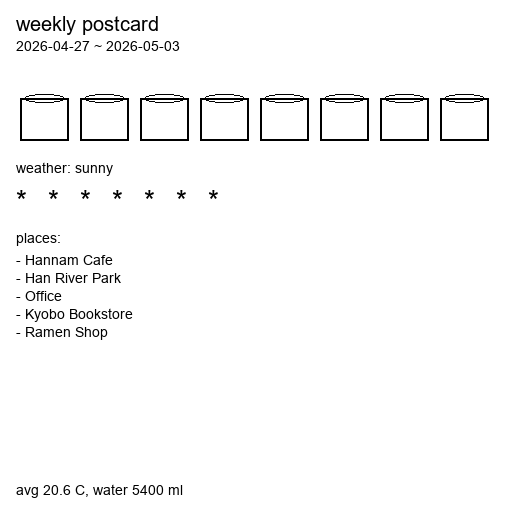
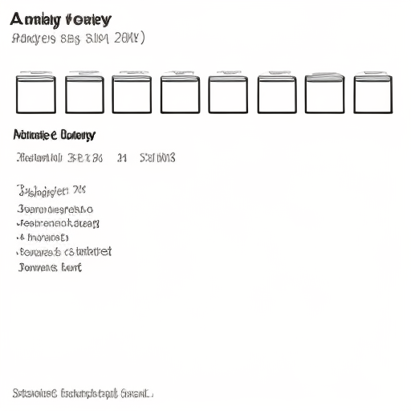
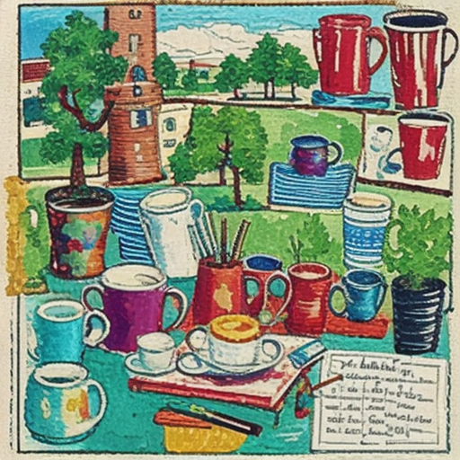
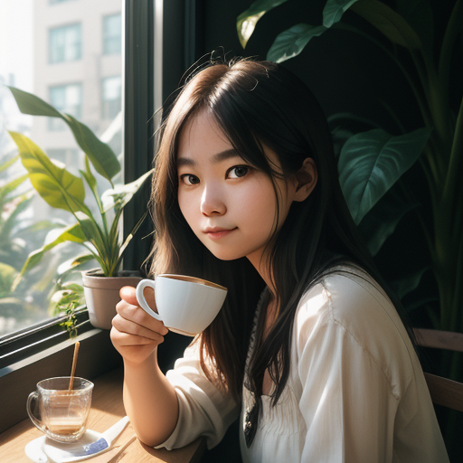

# local-ai-rnd — Weekly Postcard Doodle

PC prototype for an Android/iOS app that turns a week of personal data
(water intake, weather, GPS-derived POIs) into a deliberately badly drawn
postcard, generated on-device.

The aesthetic target (per the user's spec, in Korean):

> 첨부한 이미지를 최대한 서툴고, 휘갈긴 듯하고, 진짜 한심하게 다시 그려줘.
> 배경은 흰색으로 하고, 옛날 컴퓨터 그림판 프로그램에서 마우스로 그린 것처럼
> 보이게 해줘. ... 픽셀 하나하나 보이는 저화질 느낌도 살려서 ...

That intent is encoded as SD-friendly tags in [src/prompt_builder.py](src/prompt_builder.py).

## Result so far (CPU, SD-Turbo, seed=42)

| step | image |
|---|---|
| **Base collage** — rule-rendered from the diary, text-free pictograms (sun + cups + place-icon grid). Acts as the img2img seed. |  |
| **img2img** (32.5 s) — collage redrawn in the bad-doodle style. Layout preserved, style fully transformed. The recommended path. |  |
| **txt2img** (24.3 s) — prompt-only generation for comparison. Doodle vibe but loses the "white paper" intent and adds color. |  |

**Verdict for the mobile port**: img2img on a Skia-rendered pictographic
collage is the path. Pure txt2img is cheaper but loses too much aesthetic
control.

### Aside: what this PC can do at the *quality* end of the dial

To bracket the hardware envelope, [scripts/quality_demo.py](scripts/quality_demo.py)
runs two SD 1.5 fine-tunes at full 30-step Euler-a, same prompt + seed:

| model | runtime (CPU) | output |
|---|---|---|
| `Lykon/dreamshaper-8` (realistic) | 246 s (~8 s/step) |  |
| `dreamlike-art/dreamlike-anime-1.0` (anime) | 249 s (~8 s/step) |  |

So the PC's ceiling is "magazine-grade SD 1.5 in ~4 min/image" on plain CPU
torch. With `torch-directml` on the Radeon, expect ~30-60 s. A modern phone
NPU does the same workload in ~3-10 s — which is why on-device generation
is suddenly realistic in 2026.

## What this prototype answers

1. Can a small Stable Diffusion model produce the "intentionally bad doodle"
   aesthetic from a structured weekly summary? — **Yes** (see samples above).
2. Does img2img on a rule-rendered collage beat pure txt2img? — **Yes**, by
   a clear margin once `strength >= 0.95` so the seed is *layout guide*, not
   *content to preserve*.
3. What latency / model size do we need to budget for the mobile port? —
   SD-Turbo at 4 steps × 512² produces a frame in ~30 s on a Radeon Pro 580X
   CPU path. On an iPhone 14 Neural Engine the same workload is ~3-6 s; on a
   Snapdragon 8 Gen 2 with the MediaPipe ImageGenerator task, ~5-10 s.

The full mobile architecture lives in [docs/mobile-architecture.md](docs/mobile-architecture.md).

## Repository layout

```
local-ai-rnd/
  data/sample_week.json         7 days of fake diary data
  src/diary.py                  load + summarize a week
  src/prompt_builder.py         WeekSummary -> SD prompt
  src/base_collage.py           WeekSummary -> PIL collage (img2img seed)
  src/generator.py              SD-Turbo txt2img + img2img
  src/app.py                    Gradio UI for end-to-end testing
  outputs/                      generated PNGs
  docs/mobile-architecture.md   the on-device target
```

## Run it

Windows (PowerShell), Python 3.9+:

```powershell
# 1. (one-time) create venv + install deps
py -m venv .venv
.\.venv\Scripts\python.exe -m pip install -r requirements.txt --extra-index-url https://download.pytorch.org/whl/cpu

# 2. launch the UI locally
.\.venv\Scripts\python.exe -m src.app

# 2b. or expose a public *.gradio.live link (anyone with the URL can use it,
#     so don't leave it running unattended; link expires in ~72h)
.\.venv\Scripts\python.exe -m src.app --share
```

Then open http://127.0.0.1:7860 — the workflow is Summarize → img2img.

To regenerate the committed reference images in `samples/`:

```powershell
.\.venv\Scripts\python.exe scripts\refresh_samples.py
```

### First run

- The default model `stabilityai/sd-turbo` (~1.4 GB) downloads to the
  HuggingFace cache on first generation. Subsequent runs are instant.
- On CPU only, expect ~30-60 s per 512x512 image at 2 steps. On a GPU it
  drops to a few seconds.

### Optional GPU acceleration on AMD/Intel (Windows)

```powershell
.\.venv\Scripts\python.exe -m pip install torch-directml
$env:LAR_DEVICE = "directml"
.\.venv\Scripts\python.exe -m src.app
```

DirectML on a Radeon Pro 580X (4 GB) should be ~5-10x faster than CPU for
SD-Turbo at 512x512.

### Environment knobs

| Variable        | Default                       | Notes                                 |
|-----------------|-------------------------------|---------------------------------------|
| `LAR_MODEL_ID`  | `stabilityai/sd-turbo`        | Try `stabilityai/sdxl-turbo` if VRAM allows |
| `LAR_STEPS`     | `2`                           | SD-Turbo is happy at 1-4              |
| `LAR_GUIDANCE`  | `0.0`                         | SD-Turbo is trained with guidance off |
| `LAR_STRENGTH`  | `0.85`                        | img2img: lower = closer to base       |
| `LAR_DEVICE`    | auto (cuda > directml > cpu)  | Force `cpu` or `directml`             |

## How the prompt is built

`prompt_builder.build()` puts the **style block first** (CLIP truncates at
77 tokens, and the front of the prompt has the most influence) and concatenates
subjects derived from the diary after it:

- style → `ugly MS Paint doodle, white paper, black ink only, pixelated low-res, child scribble, jagged shaky lines, naive crude drawing`
- water_event_count → "N mismatched water cups in a row"
- dominant_weather → "smiling sun" / "lumpy clouds" / etc.
- place categories → "wobbly coffee cup", "lopsided trees", ...

Tweak the dictionaries in [src/prompt_builder.py](src/prompt_builder.py) to taste.

### Lessons from the iteration

The committed git history shows two passes (compare commits `0922e01` and `ec7dc20`):

1. **Front-load style tags** — putting them at the prompt tail meant CLIP
   silently truncated *exactly the style tokens that mattered most*, so the
   first run kept full color and ignored "white background".
2. **Keep text off the img2img seed** — early collage had English labels;
   SD reinterpreted them as garbled fake text in the output. The current
   collage is purely pictographic.
3. **Use `strength >= 0.95` on SD-Turbo img2img** — anything lower leaves
   the seed too visible. With low step counts, `strength * steps` is the
   real "denoising budget."

## What is *not* in the prototype

- Real data ingestion (HealthKit / Google Fit, weather API, geocoder). The
  prototype reads a JSON file; the mobile app will hydrate the same shape
  from on-device sources.
- Any LLM step. The prompt is rule-based on purpose — predictable and
  shippable. If you later want freer prose, hook the summary into an
  on-device LLM (Apple Intelligence FoundationModel / MediaPipe LLM).
- Multi-image postcard layout / typography. Out of scope for feasibility.
