# local-ai-rnd

> **Testing rule (applies to every script from now on):** when a LoRA
> is loaded for testing, its card-specified trigger phrase **must**
> be in the prompt. Fusing without the trigger produces ≈ no LoRA
> effect (proven by `scripts/sanity_lora.py`). Triggers are
> centralised in `src/event_prompt.py` `LORA_TRIGGERS` registry — pick
> a `visual_style` name and the prompt builder handles the trigger.

Research notes on what on-device image generation can do in 2026 — what
models run on iPhone and Android phones without per-platform engineering,
how good the output gets, and how the speed / quality / aesthetic dials
trade off.

The PC scaffold here is the testbed: a small diffusers + Gradio harness
that lets us try a checkpoint, look at the result, and decide whether it
is worth carrying to mobile. The committed `samples/` images and the
notes below are the actual research output.

## 5 event variations × 2 style LoRAs

Same SDXL-Turbo, same diffusion seed (42). Triggers auto-prepended via
the `LORA_TRIGGERS` registry (testing rule respected). Each row is one
event shape; the two columns are the two style LoRAs we like.

The prompt builder is now **non-deterministic by default** — each
cell here drew its phrases from the pools in
[src/event_prompt.py](src/event_prompt.py), so re-running this script
produces *fresh* phrasings (and slightly different images) for the
same event. See the *Randomness check* section below for proof.

Korean place names are translated to **English proper nouns**
(`광장시장 → "Gwangjang Market"`, `광화문 → "Gwanghwamun"`,
`한강 → "Hangang River"`, …) so the model has a real anchor instead
of an opaque token.

| event | data | worstimever | mspaint_portraits |
|---|---|---|---|
| `e1 xmas evening` | 19:00 / 맑음 / 12-25 / 무궁화 아파트 | 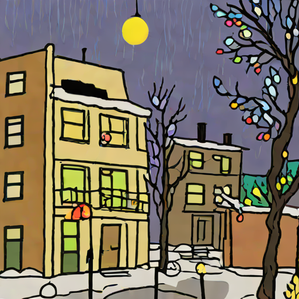 | 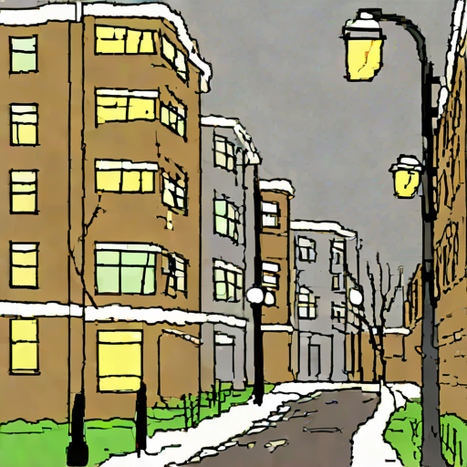 |
| `e2 summer park` | 14:30 / 맑음 / 08-15 / 한강 공원 | 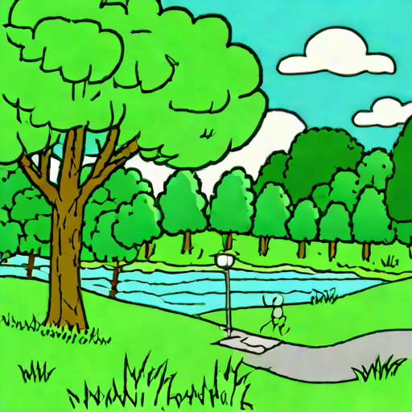 | 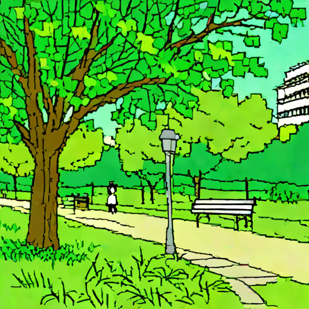 |
| `e3 rainy cafe` | 08:45 / 비 / 03-20 / 광화문 카페 | 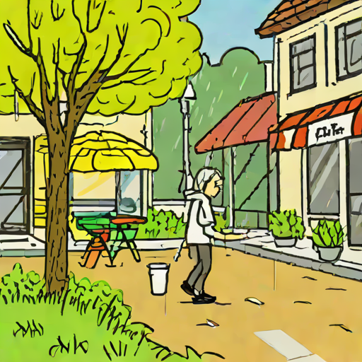 | 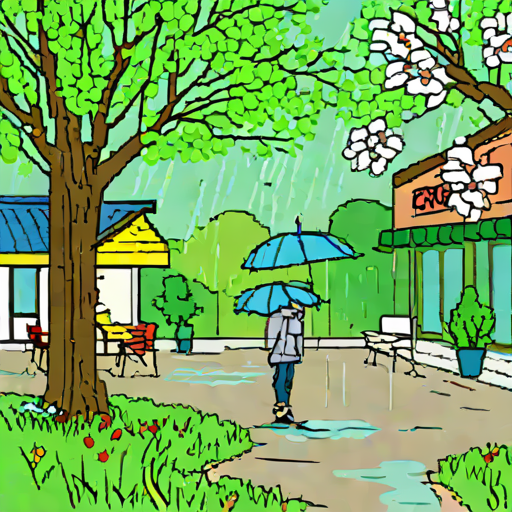 |
| `e4 autumn night home` | 23:30 / 흐림 / 10-31 / 무궁화 아파트 | 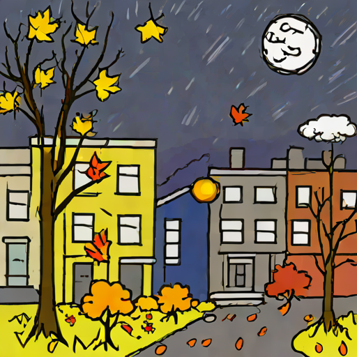 | 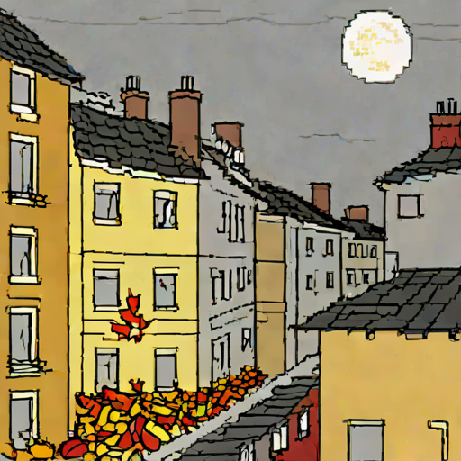 |
| `e5 snow noon market` | 12:00 / 눈 / 02-04 / 광장시장 | 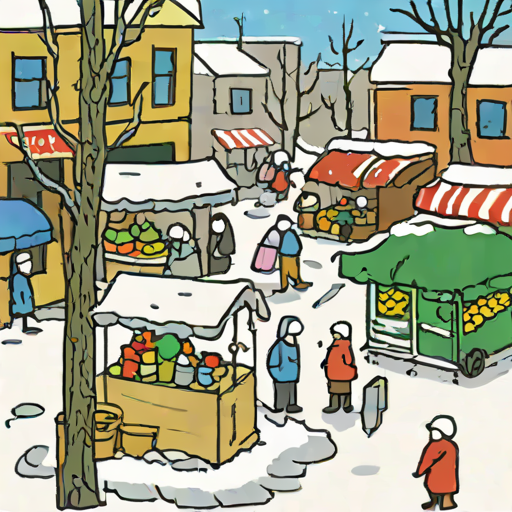 | 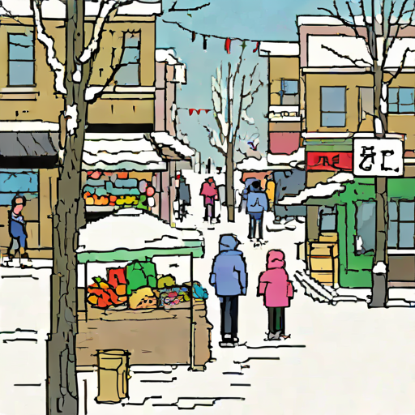 |

### Verified working end-to-end

- **Season** translation fires: 12→winter, 8→summer, 3→spring,
  10→autumn, 2→winter (visible in foliage / snow / leaves).
- **Special-date** hook fires: `12-25` → Christmas tree + lights in e1.
- **Weather** translates: 맑음 / 비 / 흐림 / 눈 each render distinct
  atmospheres (sun, rain on streets, overcast sky, snow on ground).
- **Place names** romanize: `광장시장` → *Gwangjang Market*, `광화문`
  → *Gwanghwamun*, `한강` → *Hangang River* — the model now sees an
  English noun rather than dropping the field.
- **Night** finally reads as night thanks to the strengthened phrase
  pool (`"dark night sky, big bright moon, stars, deep navy blue"` and
  three other variants) replacing the earlier weak `"night, dark
  windows, lamp glow"` that cartoon LoRAs were ignoring.
- **LoRA register stays distinct** across all 5 events:
  worstimever = saturated cartoon, thick black outlines;
  mspaint_portraits = sketchier illustration, slightly more polished.

Driver: [scripts/compare_event_variations.py](scripts/compare_event_variations.py).

## Randomness check — same event × 4 calls

User asked: *can the same input produce different images each time
the button is pressed?* Yes — every field (`time`, `date`, `weather`,
`place`) now maps to a *pool* of English phrases instead of one
fixed phrase, and `build_event_prompt()` picks at random per call.

Same `EVENT` dict, same LoRA, same model — only the random phrase
choice (and the diffusion seed) varies between cells:

| # | data phrases (post-trigger, pre-style-tags) | result |
| --- | --- | --- |
| 0 | evening dusk, lamps lit, deep blue sky, wintertime, dry brown grass, gray cold sky, Christmas, snowflakes falling | 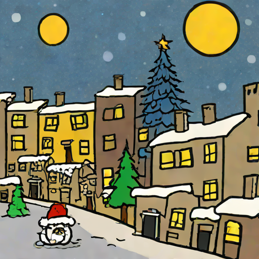 |
| 1 | early night, glowing windows, street lamps on, wintertime, dry brown grass, gray cold sky, Christmas, red-and-green wreath | 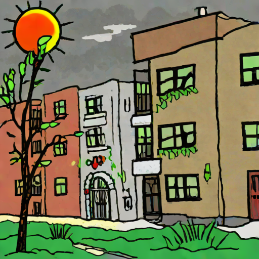 |
| 2 | early night, glowing windows, street lamps on, deep winter, leafless trees, icy ground, Christmas, red-and-green | 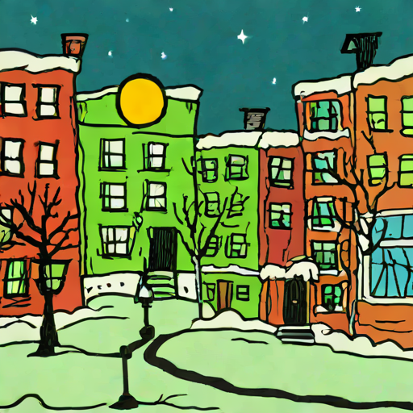 |
| 3 | early night, glowing windows, street lamps on, deep winter, leafless trees, icy ground, Christmas day, fairy lights | 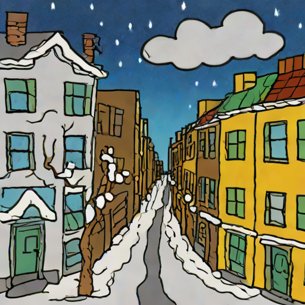 |

Pass `prompt_seed=<int>` to make the phrase pick deterministic
(useful for tests). Default is `None` = fresh randomness.

Driver: [scripts/randomness_check.py](scripts/randomness_check.py).

## Why the data-only LoRA cells looked identical — sanity check

User asked: *if a LoRA is fused at scale 0.9, why does the output look
the same as no LoRA at all?* Four-cell sanity test, same SDXL-Turbo,
same seed:

| label | LoRA state | prompt | result |
|---|---|---|---|
| **A** | none | data only |  |
| **B** | worstimever fused @ 0.9 | **trigger + data** | 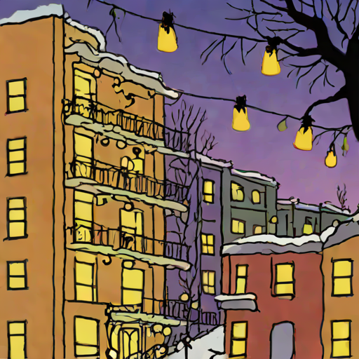 |
| **C** | worstimever still fused | data only (NO trigger) | 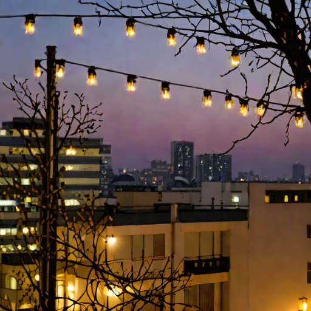 |
| **D** | unfuse + unload | data only | 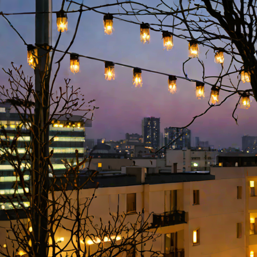 |

Findings:

- **A == D** → `unfuse_lora()` + `unload_lora_weights()` work
  correctly. The earlier "all 3 look the same" was *not* a state-leak
  bug.
- **A ≈ C** → fusing a LoRA without putting its trigger in the prompt
  produces essentially the same output as no LoRA at all.
- **A ≠ B** → with the trigger in the prompt, the LoRA gives a
  clearly different cartoon-doodle. The LoRA works fine; it just
  needs activation.

**Mechanism**: LoRA training conditions its delta on the trigger
token's cross-attention pattern. Without that token in the input
embeddings, the modified UNet weights have no signal to apply
differentially. *Fuse is necessary but not sufficient — the trigger
phrase is what activates the LoRA.*

**Production implication**: `src/event_prompt.py` should auto-prepend
the selected LoRA's trigger phrase. The user picks a visual style;
the prompt builder handles trigger plumbing under the hood.

Driver: [scripts/sanity_lora.py](scripts/sanity_lora.py).

## Data-only baseline — what does SD do with just my translated info?

User asked the cleanest possible question: *if I strip everything
extra and only give SD the translated event data, what comes out?*

Same input event (19:00 / 맑음 / 2026-12-25 / 대한민국 서울시 무궁화 아파트).
Same translation step. **No** STYLE_TAGS, **no** NEGATIVE, **no**
LoRA trigger phrase. Optionally a LoRA is fused (without trigger).

Prompt sent to SDXL-Turbo:
```
evening dusk, lamps lit, winter, bare branches, Christmas day,
fairy lights, festive, clear sky, Korean setting,
tall apartment buildings
```

| LoRA fused (no trigger in prompt) | result |
|---|---|
| (none) |  |
| `worstimever_xl.safetensors` @ 0.9 |  |
| `sdxl_mspaint_portraits.safetensors` @ 0.9 | 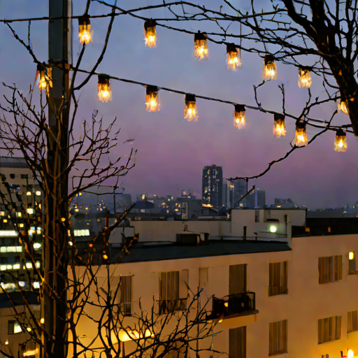 |

### Three findings

1. **All three outputs are nearly identical** — photorealistic dusk
   skyline of a Seoul-ish apartment block with hanging string lights
   and bare branches. Nothing doodle-like.
2. **Loading a LoRA without its trigger in the prompt does almost
   nothing.** The LoRA style is gated on the trigger token, not on
   fuse-time weights alone.
3. **Translated data alone → SDXL-Turbo's default = clean photo.**
   The 한심 doodle look needs an explicit instruction in the prompt.

### The full prompt-layer stack we have built

Each layer is additive and optional. User picks which to ship per
visual mode.

```
raw event (time / weather / date / country / city / place)
    │
    ▼   src/event_prompt.py  field → phrase tables
    └─ translated English phrases     →  result is a clean photo
    │
    ▼   add LoRA trigger token at front
    └─ + LoRA trigger                 →  result picks up the LoRA's
                                          light style flavour
    │
    ▼   prepend STYLE_TAGS block
    └─ + 'ugly MS Paint doodle, ...'  →  result is the deliberately-bad
                                          doodle (load-bearing layer!)
    │
    ▼   add NEGATIVE prompt
    └─ + 'photorealistic, polished'   →  push out the photo / polish
                                          tendency that keeps leaking
                                          back in
```

Driver: [scripts/compare_data_only.py](scripts/compare_data_only.py).

## Raw LoRA capability — what each LoRA actually does

We had been showing 하찮은-style results that looked like the LoRAs
were delivering the trend register. Stripping every additional
prefix (no STYLE_TAGS, no NEGATIVE prompt, no event-data translation)
and using only `{LoRA-card trigger}, {minimal subject}` reveals the
load was actually being carried by our prefix, not the LoRAs.

Same subject across all five cells: `a young man holding a coffee
cup at a cafe table`. Same seed. Base = SDXL-Turbo (cleanest LoRA
expression).

| cell | trigger only | result |
|---|---|---|
| no LoRA (baseline) | (none) | 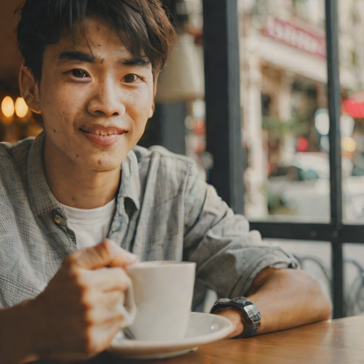 |
| **worstimever** | `DD-wte artstyle, ` | 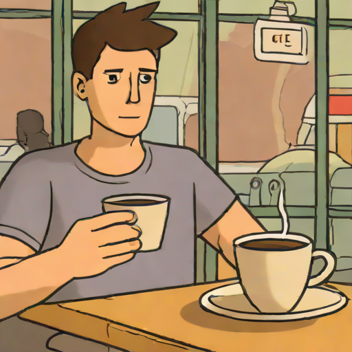 |
| **mspaint_portraits** | `MSPaint drawing of ` | 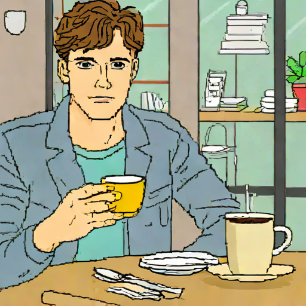 |
| **pixel_art_xl** | `pixel art, ` | 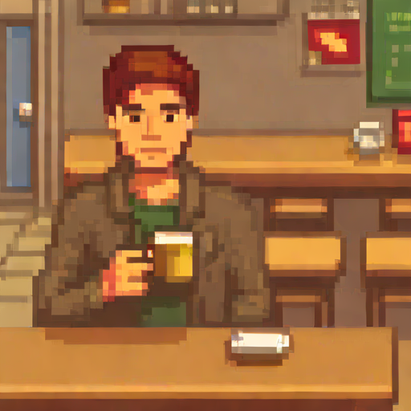 |
| **lah_cute_social** | `cute doodle, ` | 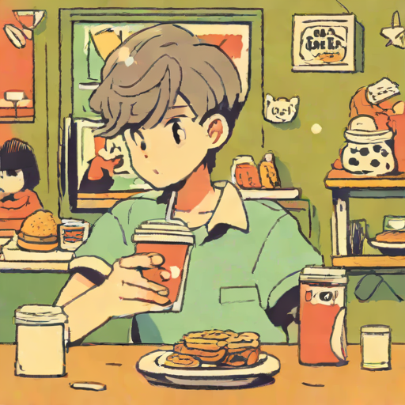 |

### Honest finding

- **baseline**: clean photorealistic cafe scene — SDXL-Turbo default.
- **worstimever**: a *clean* cartoon man at a cafe. Slightly wonky
  proportions but the deliberately-bad doodle character does NOT
  appear from just the `DD-wte artstyle` trigger.
- **mspaint_portraits**: a polished magazine-style illustration. There
  is nothing MS-Paint-like in the output. The name is misleading.
- **pixel_art_xl**: does what it says. Consistent retro pixel art.
- **lah_cute_social**: anime/manga-leaning character output, behaves
  like a subject LoRA more than a style filter.

**The "한심한" register in our earlier rounds was carried by our
STYLE_TAGS prefix**:

```
ugly MS Paint doodle, white paper, black ink only,
pixelated low-res, child scribble, jagged shaky lines,
naive crude drawing
```

LoRAs were adding *minor flavour on top*. If the goal is the
deliberately-bad doodle aesthetic, the prefix is the load-bearing
piece — and we may not even need a LoRA at all, or we should
specifically search for a LoRA trained on actual deliberately-bad
drawings (vs. these which turn out to be generic cartoon styles).

Driver: [scripts/compare_loras_raw.py](scripts/compare_loras_raw.py).

## Lightning + style-LoRA quality fixes — A/B/C/D shootout

Earlier round flagged a real gap: SDXL-Turbo + worstimever (v10)
produces clean stylized output, but the commercial path
(SDXL 1.0 base + Lightning LoRA + worstimever) muddies the worstimever
character because two LoRAs fight for the same UNet layers. Four
candidate fixes, all on the same Christmas event + seed:

| option | result | reads |
|---|---|---|
| **A** Lightning UNet variant (3 GB UNet swap, worst@0.9) | 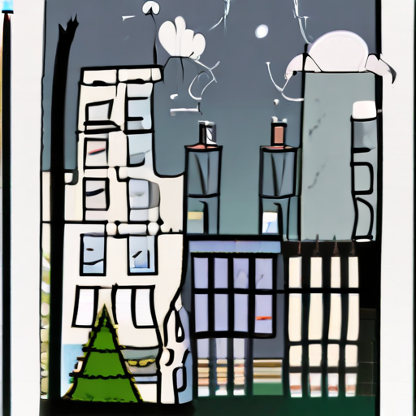 | strongest worstimever character preserved — thick scratchy outlines + snow + tree. Closest to v10. Cost: ship the 3 GB UNet per visual mode. |
| **B** Lightning 8-step LoRA (worst@0.9) | 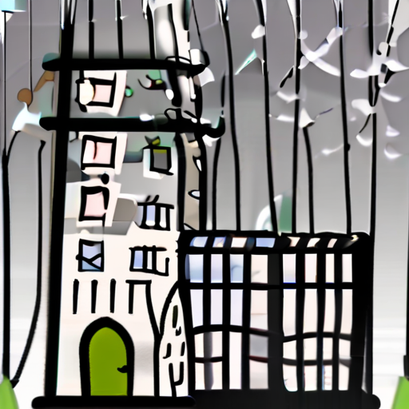 | single tower + kid-sketch character. More denoise budget but starts polishing away the wonky bits. |
| **C** Lightning 4-step + worstimever@1.2 | 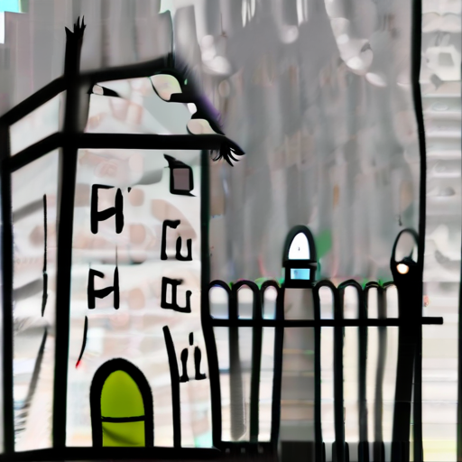 | scaling worst stronger produces *chaos* instead of clean style. Force-scale doesn't fix the LoRA conflict. |
| **D** Hyper-SD 4-step LoRA + worst@0.9 (TCDScheduler) | 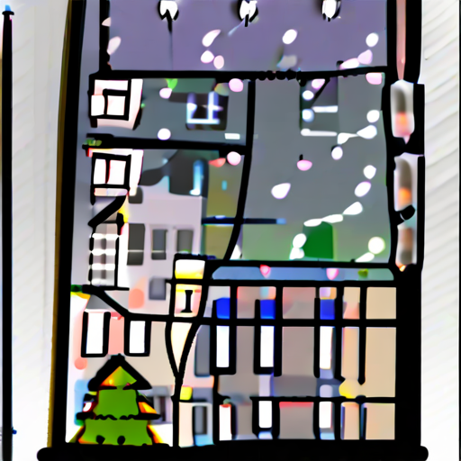 | cleanest Christmas-card composition: apartments + tree + string lights + dusk. Outlines softer than worstimever's signature; less 한심함 but a distinct viable mode. |

Two recommended tracks:

| track | stack | trade-off |
|---|---|---|
| **Quality-first** | A — Lightning UNet variant + worstimever | matches v10 vibe; ships 3 GB extra UNet per visual mode |
| **Mobile-economics** | D — Hyper-SD 4-step LoRA + worstimever | shares base; only +787 MB LoRA per mode; visual register is cleaner Christmas-card style |

Driver: [scripts/compare_options.py](scripts/compare_options.py).

## Commercial-OK base shootout (current top-of-stack)

User picked worstimever + sdxl_mspaint_portraits as the two favourite
style LoRAs but flagged that SDXL-Turbo's base license is non-commercial.
Both candidate bases use the same SDXL architecture (so the chosen
LoRAs stay compatible) and both are Open RAIL++ M (commercial-OK):

| base | step / guidance | size |
|---|---|---|
| **SDXL 1.0 base** (`stabilityai/stable-diffusion-xl-base-1.0`) | 30 step / 7.0 | ~6.5 GB |
| **SDXL Lightning** (`ByteDance/SDXL-Lightning`, 4-step LoRA over SDXL base) | 4 step / 0.0 | base + 394 MB LoRA |

Same Christmas event input + seed across the four cells:

| | worstimever | mspaint_portraits |
|---|---|---|
| **SDXL 1.0 base 30-step** | 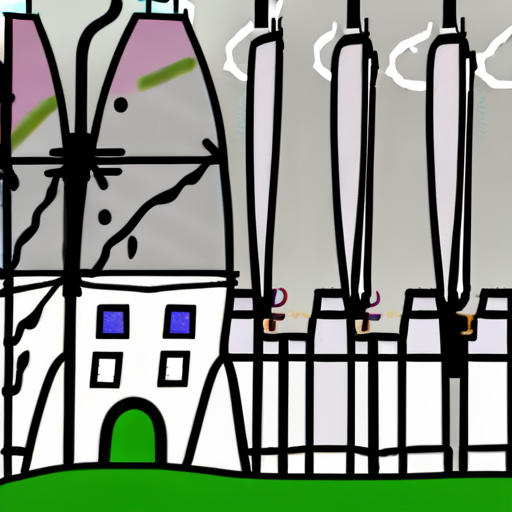 | 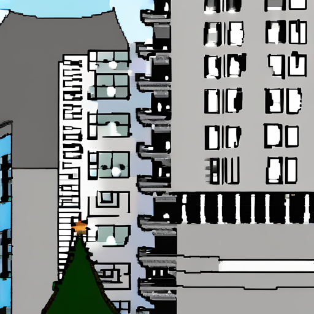 |
| **SDXL Lightning 4-step** | 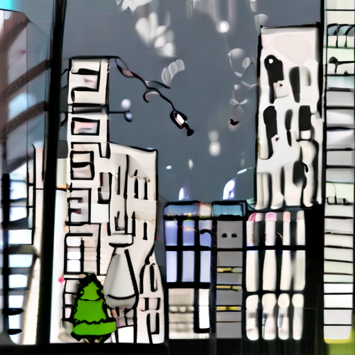 | 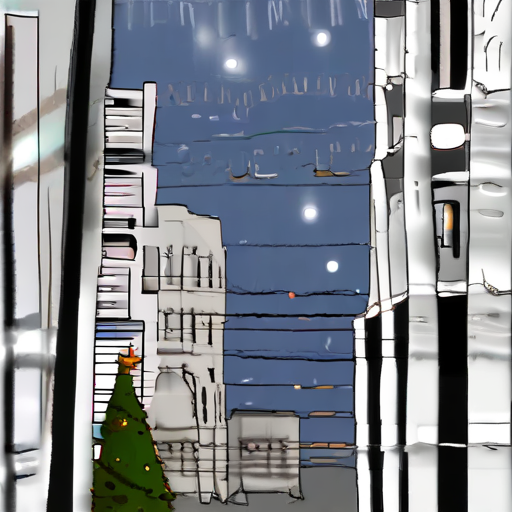 |

Reads:

- **base 30-step + worstimever** — over-refined, lost scene coherence,
  the LoRA's "deliberately wonky" character washes out under full denoise.
- **base 30-step + mspaint_portraits** — clean apartment + Christmas tree
  illustration. Polished, not 한심함.
- **Lightning 4-step + worstimever** — rough outlines + scribble
  strokes + tree visible. Closest to the v10 trend register, and the
  30-step polish problem is gone because Lightning's denoise budget is
  shorter.
- **Lightning 4-step + mspaint_portraits** — string lights + tree +
  dusk sky. Middle ground, viable alternate visual mode.

### Verdict — new commercial-OK default

**SDXL 1.0 base + SDXL Lightning 4-step LoRA + worstimever style LoRA**
- License: Open RAIL++ M everywhere → commercial product OK
- Speed regime: 4-step (same as SDXL-Turbo) → mobile NPU 3-10 s
- Trend register: matches v10 vibe (one of which we already shipped)
- Mobile path: bake all LoRAs into one merged checkpoint, convert via
  `apple/ml-stable-diffusion` to `.mlpackage`. ~3 GB after 6-bit
  quantization. iPhone 14 Pro+ / Snapdragon 8 Gen 2+.

Driver: [scripts/compare_bases.py](scripts/compare_bases.py) — drop
new bases or stacked LoRAs in, rerun.

## LoRA shootout (same Christmas event, 4 SDXL LoRAs)

User picked 6 candidate LoRAs from Civitai. Two (`pokemon-trainer-sprite`,
`sketchit`) require Civitai login for direct download — skipped. One
(`ms-paint-lora`) is SD 1.5, dim-incompatible with our SDXL-Turbo
base — skipped. The four runnable ones, all on the same input event
and seed, with only the LoRA + trigger swapping:

| LoRA | trigger | result |
|---|---|---|
| `worstimever` (current v10 default) | `DD-wte artstyle, worst-im-ever cartoon doodle` | 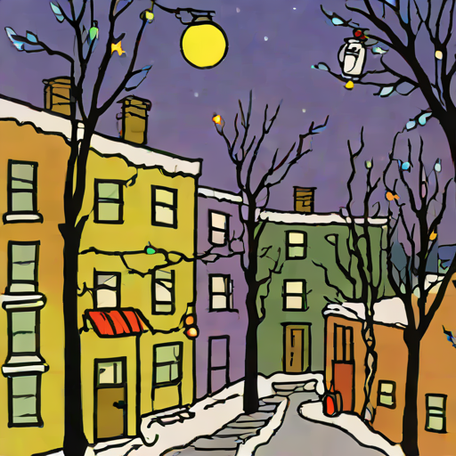 |
| `sdxl_mspaint_portraits` | `MSPaint drawing` | 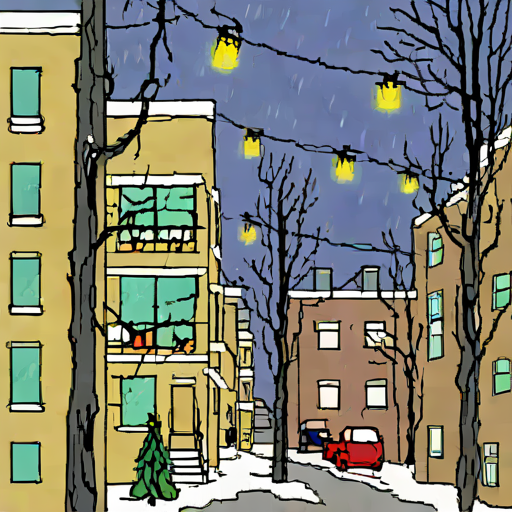 |
| `lah_cute_social` | `cute doodle` | 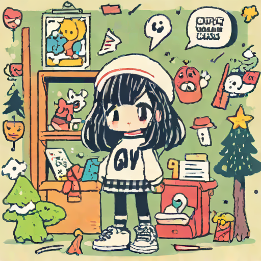 |
| `pixel_art_xl` | (none) | 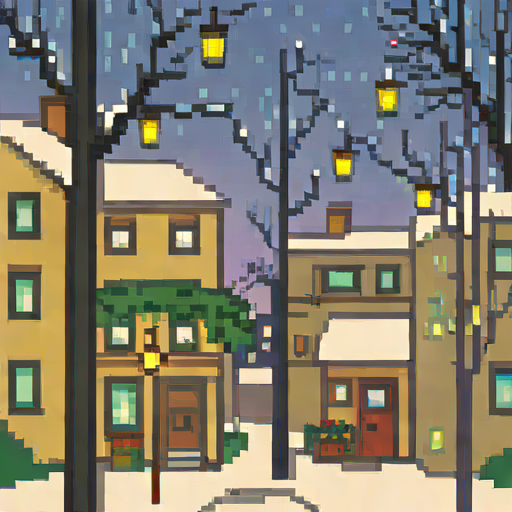 |

Reads of each:

- **worstimever** — saturated palette, thick outlines, "earnestly wonky"
  Korean apartment + Christmas lights + bare trees. Still the closest
  match to the trend's deliberately-bad register.
- **mspaint_portraits** — despite the name, output is a clean
  Christmas illustration with detailed buildings, string lights, a
  little red car. Polished, not crude — off-target.
- **lah_cute_social** — behaves like a character LoRA: drops the
  scene entirely and inserts a kawaii sticker-girl surrounded by
  Christmas decor. Wrong tool for "draw the scene from the data".
- **pixel_art_xl** — preserves the scene composition exactly but in
  16-bit RPG aesthetic. Not the 하찮은 trend but a *legit alternative
  viral angle* for users who want a Stardew-Valley-style retro vibe.

Verdict: worstimever stays the default for v10. pixel_art_xl is
worth keeping as a separate visual mode.

Driver: [scripts/compare_loras.py](scripts/compare_loras.py) — drop
new LoRA `.safetensors` files into `models/lora/`, add a row to
`LORA_TABLE`, rerun.

### License caveat (per user concern)

| layer | license | commercial product? |
|---|---|---|
| SDXL-Turbo (base) | **Stability Non-Commercial Research License** | ❌ requires paid Stability commercial license |
| each LoRA | varies per Civitai page (Allowed Use toggles) | needs per-LoRA check on civitai.com |

Even if every LoRA's "Allowed Use" toggles are permissive, the
SDXL-Turbo base alone forbids commercial product. For shippable
product the base needs to flip to SDXL 1.0 base / SD 1.5 / FLUX.1
schnell (Apache 2.0, fully commercial-safe). v10 stands as a
prototype/research milestone.

## Single-event flow — button press → prompt → image

The actual product flow when the user presses the "draw this moment"
button. Input is a single event captured at that instant, not a
weekly aggregate.

Mapping is **deterministic and inspectable** — every field becomes a
specific phrase via small editable dictionaries in
[src/event_prompt.py](src/event_prompt.py). User can read the
breakdown and see exactly what their data turned into.

### Input event (literal user example)

| field | value |
|---|---|
| time | 19:00 |
| weather | 맑음 |
| date | 2026-12-25 |
| country | 대한민국 |
| city | 서울시 |
| place | 무궁화 아파트 |

### Field → phrase pool (one example draw)

Each input field maps to a **pool** of English phrases; the builder
picks one at random per call (or per `prompt_seed`). One example draw:

| source | bucket | phrase drawn |
|---|---|---|
| `time=19:00` | `evening` | `evening dusk, lamps lit, deep blue sky` |
| `date=2026-12-25` | `winter` | `wintertime, dry brown grass, gray cold sky` |
| `date=2026-12-25` | special | `Christmas, snowflakes falling, lit Christmas tree, Santa hat` |
| `weather=맑음` | `clear` | `crisp clear weather, deep blue sky, single fluffy cloud` |
| `country=대한민국` | — | `Korean setting` |
| `place` matches `아파트` | — | `tall Korean apartment buildings` |

The pools live at the top of [src/event_prompt.py](src/event_prompt.py)
as `_TIME_PHRASES`, `_SEASON_PHRASES`, `_SPECIAL_DATE_PHRASES`,
`_WEATHER_PHRASES`, and `_PLACE_PROPER_NOUNS`. Edit them and the next
call picks from your edits.

### Final prompt sent to SDXL-Turbo

Order matters because CLIP truncates at 77 tokens. The trigger goes
first (load-bearing for the LoRA), then the user-data phrases (the
whole point of the prompt), and *only then* the generic STYLE_TAGS —
so when the prompt overruns the limit, the generic style hints get
dropped, not the user's actual moment:

```
DD-wte artstyle, worst-im-ever cartoon doodle,
evening dusk, lamps lit, deep blue sky,
wintertime, dry brown grass, gray cold sky,
Christmas, snowflakes falling, lit Christmas tree, Santa hat,
crisp clear weather, deep blue sky, single fluffy cloud,
Korean setting,
tall Korean apartment buildings,
ugly MS Paint doodle, white paper, black ink only, pixelated low-res,
child scribble, naive crude drawing
```

### Generated image

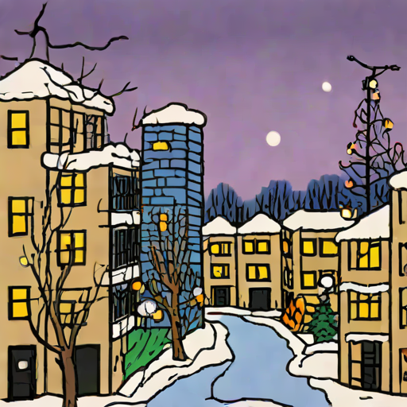

The doodle visibly reflects every field — purple dusk sky, lit
apartment windows, snow on roofs, bare branches + evergreen pines, a
Christmas tree with lights on the right. Each visual element traces
back to a row in the table above. Driver:
[scripts/match_user_event.py](scripts/match_user_event.py).

### Editing the mapping

Want a different translation for the same input? Edit the phrase
pools at the top of [src/event_prompt.py](src/event_prompt.py) —
they're plain `dict[str, list[str]]` data. Add a new variant to
`_TIME_PHRASES["night"]` and the next call may pick yours; expand
`_PLACE_PROPER_NOUNS` to romanize a new neighborhood. Rerun
`scripts/randomness_check.py` (or any other driver) to see the new
result.

## v10 — diary-aggregate flow (multiple events into one weekly postcard)

The product spec, after iteration: feed diary text (time / weather /
place) and get back an **unexpected scene drawn in the 하찮은
register**. No photo input, no image conversion. Every call should
surprise — same data twice should give different outputs.

```
diary text
  -> prompt_builder (fresh phrasing per call)
  -> worstimever LoRA trigger
  -> SDXL-Turbo txt2img (LoRA fused at scale 0.9)
  -> result
```

| seed | protagonist | moments injected | result |
|---|---|---|---|
| 11 — rainy 6/7 days | weather | umbrellas crossing a quiet alley · a steaming bowl of noodles · a long shadow on a quiet street | 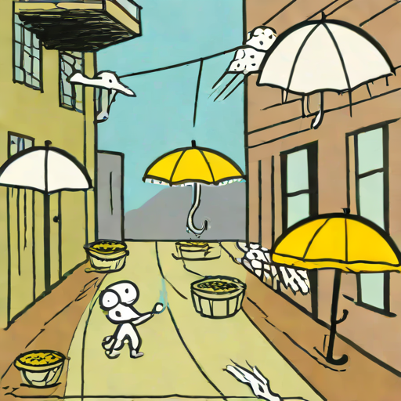 |
| 22 — cafe daily | place | a marble counter with a single espresso · a sunny park bench · warm evening light through a window | 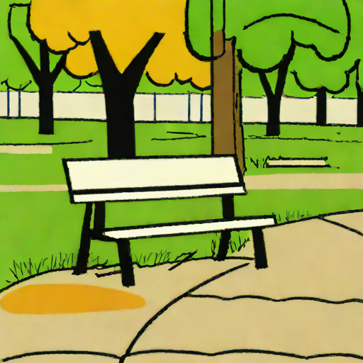 |
| 33 — morning sips | time | a quiet kitchen at sunrise · a curtain billowing in a quiet room · a small reading nook with a lamp | 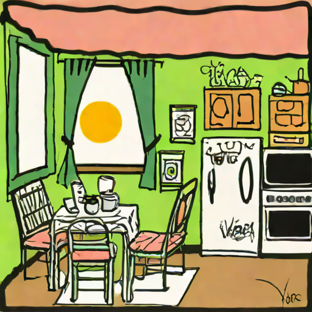 |
| 44 — 36 cups | cups | a counter crowded with mismatched water cups · soft overcast sky · a fountain in a public square · afternoon light | 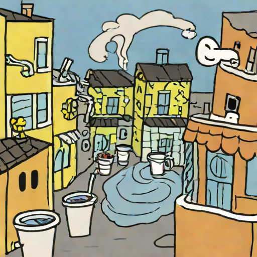 |
| 22 again, fresh RNG | place | a cozy cafe window seat · a sunny park bench · a desk lamp glowing at dusk | 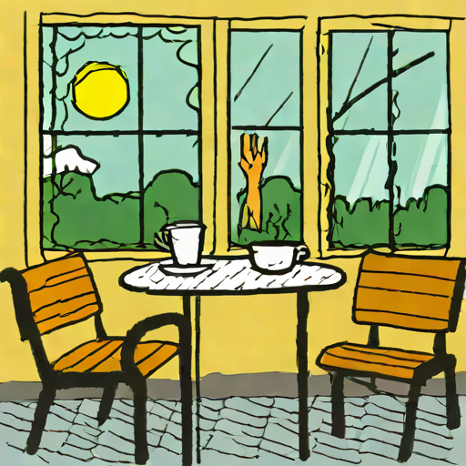 |

### Full prompt structure

The actual string handed to SDXL-Turbo for every generation is:

```
{LORA_TRIGGER}, {STYLE_TAGS}, a postcard of one quiet week: {MOMENTS}
```

with the constant pieces being:

```
LORA_TRIGGER  = "DD-wte artstyle, worst-im-ever cartoon doodle"

STYLE_TAGS    = "ugly MS Paint doodle, white paper, black ink only,
                 pixelated low-res, child scribble, jagged shaky lines,
                 naive crude drawing"

NEGATIVE      = "photorealistic, sharp focus, polished, professional,
                 hd, anti-aliased, smooth gradient, oil painting"
```

`MOMENTS` is whatever `prompt_builder.build()` picks per call from the
per-axis phrase pools in [src/prompt_builder.py](src/prompt_builder.py).
Below are the full strings actually run for each of the five samples
above (CLIP truncates everything past 77 tokens — the "..." marks
where truncation happened in practice).

#### `v10_w11_v1` (weather protagonist)
```
DD-wte artstyle, worst-im-ever cartoon doodle, ugly MS Paint doodle,
white paper, black ink only, pixelated low-res, child scribble,
jagged shaky lines, naive crude drawing, a postcard of one quiet
week: umbrellas crossing a quiet alley, a steaming bowl of noodles
on a wooden table, a long shadow on a quiet... [truncated]
```

#### `v10_w22_v1` (place protagonist)
```
DD-wte artstyle, worst-im-ever cartoon doodle, ugly MS Paint doodle,
white paper, black ink only, pixelated low-res, child scribble,
jagged shaky lines, naive crude drawing, a postcard of one quiet
week: a marble counter with a single espresso, a sunny park bench
in late afternoon, warm evening light through a... [truncated]
```

#### `v10_w33_v1` (time protagonist)
```
DD-wte artstyle, worst-im-ever cartoon doodle, ugly MS Paint doodle,
white paper, black ink only, pixelated low-res, child scribble,
jagged shaky lines, naive crude drawing, a postcard of one quiet
week: a quiet kitchen at sunrise, a curtain billowing in a quiet
room, a small reading nook with a lamp
```

#### `v10_w44_v1` (cups protagonist)
```
DD-wte artstyle, worst-im-ever cartoon doodle, ugly MS Paint doodle,
white paper, black ink only, pixelated low-res, child scribble,
jagged shaky lines, naive crude drawing, a postcard of one quiet
week: a counter crowded with mismatched water cups, a soft overcast
sky over rooftops, a fountain in a public square, afternoon light
across a wooden floor [truncated past "public square"]
```

#### `v10_w22_v2` (same data as `w22_v1`, fresh RNG)
```
DD-wte artstyle, worst-im-ever cartoon doodle, ugly MS Paint doodle,
white paper, black ink only, pixelated low-res, child scribble,
jagged shaky lines, naive crude drawing, a postcard of one quiet
week: a cozy cafe window seat with a coffee cup, a sunny park bench
in late afternoon, a desk lamp glowing at... [truncated]
```

Notes on prompt construction:

- The **STYLE_TAGS block is front-loaded** because CLIP truncates at
  77 tokens — putting the style first ensures the doodle aesthetic
  always survives even when the diary moments push the prompt over.
- The **moments are picked per call** from per-axis phrase pools, so
  `w22_v1` and `w22_v2` end up with overlapping but different scene
  combinations even on identical input data — the surprise property.
- The **LoRA trigger phrase** comes from the worstimever LoRA card
  (`DD-wte`). It's what flips SDXL-Turbo from default cartoon into
  the deliberately-bad register.

What works:
- ✅ **하찮은 doodle register** (worstimever LoRA delivers — flat colour, thick black outlines, deliberately childlike)
- ✅ **Unexpected scene choices** ("rainy" → yellow umbrellas in alley; "many cups" → cups scattered between houses)
- ✅ **Same data → different image** (`w22_v1` vs `w22_v2`)
- ✅ **No photo conversion needed** — diary text is the only input

Driver: [scripts/match_user_ref_v10.py](scripts/match_user_ref_v10.py).

### Mobile envelope (with the SDXL choice)

User dropped iPhone 12 support (A14) to get the SDXL LoRA ecosystem.
Target hardware: **iPhone 14 Pro+ (A16) and Snapdragon 8 Gen 2+
Android phones**.

- SDXL-Turbo Core ML: `apple/coreml-stable-diffusion-xl-base` (~3 GB
  at 6-bit), runs in ~3-10 s per image on A16 ANE
- LoRA hot-swap is not supported on Core ML / MediaPipe → each
  shipped style is one pre-merged checkpoint, ~3 GB per style
- worstimever weights merged into SDXL-Turbo at `lora_scale=0.9`
  before conversion = ship one .mlpackage per visual style

## Earlier rounds (kept for the journey)

### 하찮은 프롬프트 — user-tested rounds (v4–v9)

User uploaded an actual ChatGPT 하찮은 프롬프트 input/output pair via
GitHub. The pipeline now matches the trend's defining property —
**the input photo's subject is recognisable in the output**, not just
"some person doodled".

### v4 pipeline (current best)

```
photo -> SD-Turbo img2img (strength 0.65, doodle prompt)
      -> rembg (U2-Net foreground extraction, ~25 MB, mobile-portable)
      -> composite onto white
      -> kasun_color (flat colour fill + thick black outlines)
```

| stage | image |
|---|---|
| 0. **Input photo** (uploaded to ChatGPT by user) | 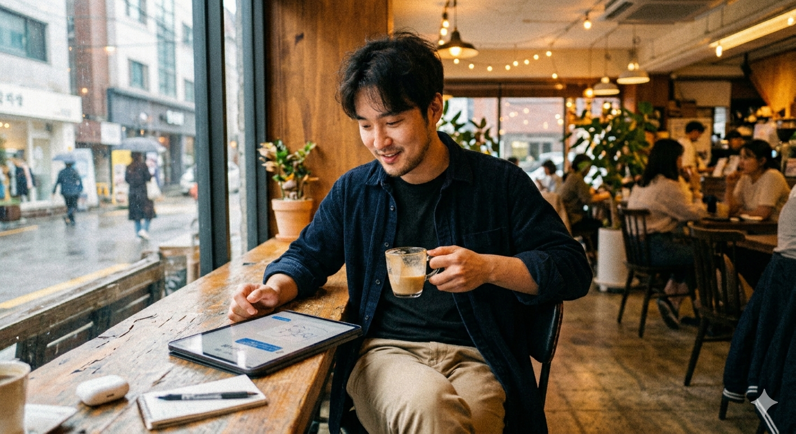 |
| 1. SD-Turbo img2img — keeps photo pose, redraws as cartoon | 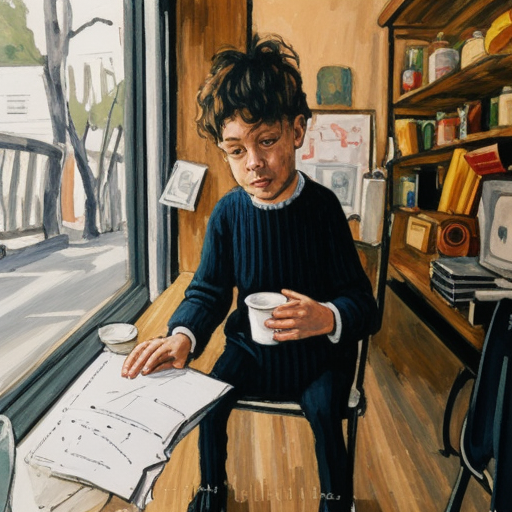 |
| 2. + rembg — subject extracted onto white | 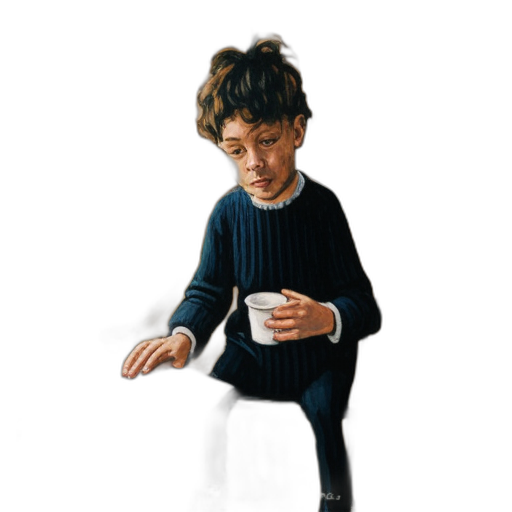 |
| 3. + kasun_color — final 하찮은 finish | 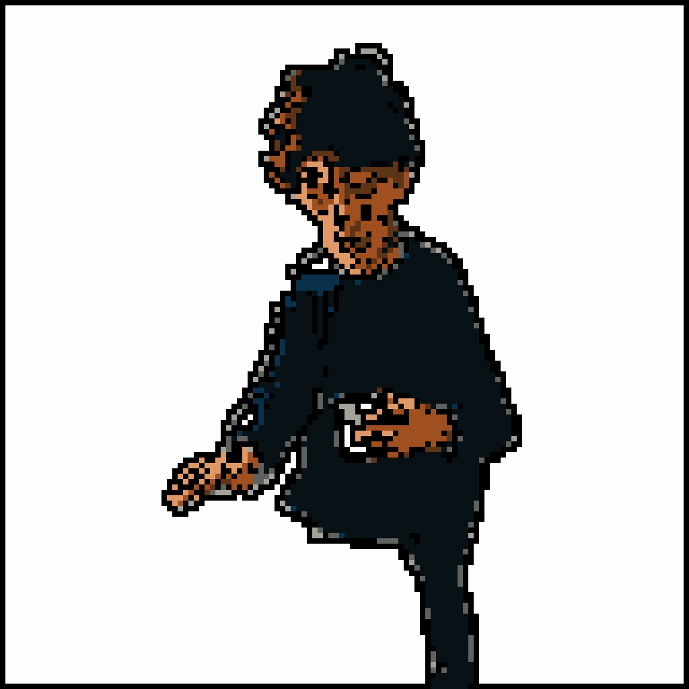 |
| **target — ChatGPT 하찮은 result** |  |

### What now matches

✅ **Same person recognisable**: dark hair, peach skin, dark cardigan,
sitting pose holding the coffee cup — same as the photo, not a
hallucinated stranger.
✅ **Aesthetic registers**: flat colour fill, thick black outlines,
visible chunky pixels, white paper background, deliberately wonky
proportions, naive amateur energy.

### Remaining gaps (next iterations)

- ChatGPT keeps a *little* surrounding scene context (small plant,
  hanging lights as faint side detail). rembg cuts everything except
  the subject, so our v4 has a fully empty BG. Could be fixed by a
  looser alpha-matting or a "subject + nearest neighbours" pass.
- Face has slightly too much pixel noise from kasun's 8-colour
  palette over the SD output's gradient skin shading. Tuning kasun's
  `smooth` parameter higher should clean this up.

### Why earlier attempts didn't work

| version | approach | failure mode |
|---|---|---|
| v1 | bilevel kasun on plain SD-Turbo doodle | 1-bit Game Boy bitmap, wrong target |
| v2 | colour kasun | aesthetic close but BG dark, not white paper |
| v3 | txt2img + kasun_color w/ flood-fill | white BG but SD invented a stranger |
| v4 | img2img(0.65) + rembg + kasun_color | identity preserved + white BG, but reads as 8-bit RPG sprite — too pixel-perfect, not the wobbly mouse-drawn target |
| v5 | minimal post-process, prompt-driven | SD-Turbo can't natively do wobbly hand-drawn |
| v6 | cv2 stylize / pencilSketch on SD output | closer hand-drawn feel, but no single filter hits all of (thick lines + pastel + wobble) |

### v5 / v6 exploration (current)

After v4 the user pointed out the result reads as a clean pixel sprite,
not the wobbly mouse-drawn ChatGPT trend. Two pivots:

**v5** — strip post-processing, lean on SD-Turbo prompt:

| strength | image |
|---|---|
| 0.55 |  |
| 0.70 | 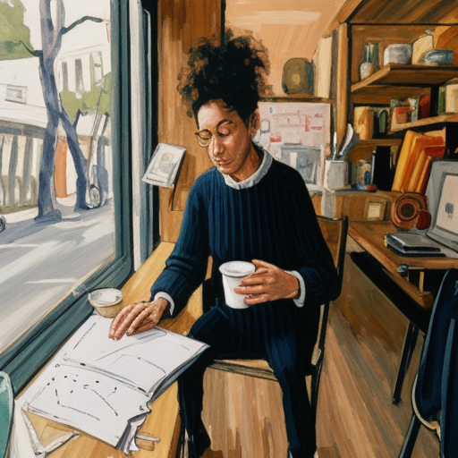 |
| 0.85 | 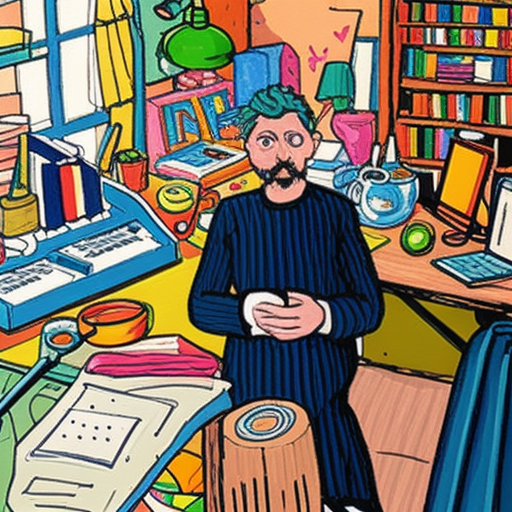 |

Reads: SD-Turbo doesn't natively produce the shaky mouse-drawn style
regardless of strength.

**v6** — OpenCV's purpose-built artistic filters on the SD output:

| filter | image | reads |
|---|---|---|
| stylize_60_045 | 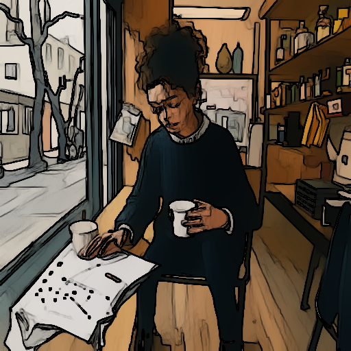 | thick cartoon outlines, saturated colour, clean (not wobbly) |
| stylize_150_07 | 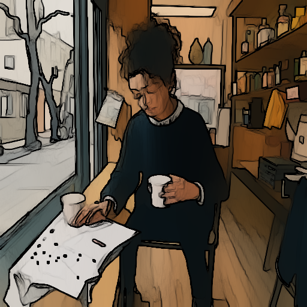 | same family, smoother |
| pencil_30_05_005 | 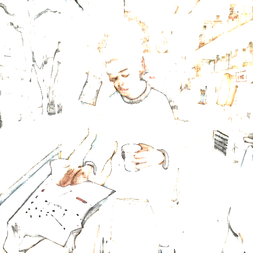 | loose pencil + watercolour wash, white space, hand-drawn feel ✓ |
| pencil_60_07_005 |  | too desaturated |

(Full grids: [match_v5_grid.md](samples/match_v5_grid.md),
[match_v6_grid.md](samples/match_v6_grid.md).)

The closest single output is `pencil_30_05_005` (best hand-drawn feel)
or `stylize_60_045` (thick outlines), but neither hits all of the
trend's defining qualities at once: thick black outlines + flat
colour fill + visible mouse-tremor wobble.

### v7 — cv2 stylization + row-jitter wobble (current best)

User feedback after v6: prefer the colourful-cartoon direction (v5
strength=0.85 style), not the pastel pencil sketch. So v7 keeps
saturation high, takes the thick stylized edges from cv2, and adds
random per-row horizontal jitter to fake mouse-tremor.

| stage | image |
|---|---|
| input |  |
| SD-Turbo img2img (s=0.75, cartoon prompt) |  |
| + cv2.stylization (sigma_s=60, sigma_r=0.45) |  |
| + jitter ±1 px |  |
| + jitter ±2 px |  |
| + jitter ±3 px (most hand-drawn feel) |  |
| reference — ChatGPT 하찮은 (target) |  |
| user-favourite from v5 s=0.85 |  |

v7 j3 hits the user-preferred aesthetic register: recognisable
subject + thick black outlines + colourful flat fill + mouse-tremor
wobble. Setting drifted from cafe interior to city street because
SD-Turbo at strength 0.75 redraws the BG context too freely; that's a
prompt / strength tuning step.

### v8 — prompt-wording sweep on the v7 pipeline

Five wording variants on the same SD-Turbo img2img(0.75) +
cv2.stylization + ±3 px jitter pipeline:

| variant | image | reads |
|---|---|---|
| `p1` "5-year-old + computer mouse" |  | small subject, dark cramped BG |
| `p2` "wrong hand sketch" |  | SD literally drew a *rodent* — "mouse" word triggered the animal cluster |
| `p3` "MS Paint 1995 amateur" |  | same rodent confusion |
| **`p4` "kindergarten crayon"** |  | **strongest naive-child register**: stick-figure, simple shapes, scribble BG, bright kid-art colours. Identity is gone, the style is unmistakable. |
| `p5` "intentionally bad sketch" |  | recognisable subject + colourful cartoon, same family as v5_s85 |

Two findings:

1. **Two valid sub-aesthetics for "the trend"**: (a) the *child-art
   naive* style (p4) and (b) the *colourful cartoon with thick
   outlines* style (p5 / v5_s85). The first nails "5살 어린이가
   그렸다" but loses identity; the second preserves identity but is
   more refined-cartoon than wobbly-amateur.
2. **Avoid the literal word `mouse` in SD prompts.** SD-Turbo
   interprets it as the rodent and outputs an actual mouse character.
   Use `stylus`, `input device`, or just `scribbled with shaky hand`
   instead.

(Full grid: [match_v8_grid.md](samples/match_v8_grid.md).)

Next round: LoRA experiments — see if a "child drawing" or "MS Paint"
LoRA can deliver p4's naive register *while* preserving subject
identity from the photo, the way p5 does for the cartoon style.

### Mobile note

rembg ships as `u2net.onnx`, ~25 MB. Runs on iOS Core ML and Android
NNAPI alongside the SD-Turbo Core ML / ONNX pipeline. The whole v4
flow is two ML inferences (SD-Turbo + rembg) plus pure pixel ops
(kasun_color). Same on-device feasibility envelope as before.

Driver: [scripts/match_user_ref_v4.py](scripts/match_user_ref_v4.py).
Filter: [src/kasun_filter.py](src/kasun_filter.py) `kasun_color`.

## Hardware envelope of this PC

- AMD Radeon Pro 580X (4 GB), CPU torch only — no CUDA, no torch-directml
- Python 3.9, diffusers + transformers + Gradio
- Reference numbers below are for **CPU FP32 inference**. For comparison:
  - DirectML on the Radeon: ~5-10× faster than these numbers
  - iPhone 14+ Apple Neural Engine: ~3-10 s for the same workloads
  - Snapdragon 8 Gen 2 Hexagon NPU: ~5-10 s

That gap matters because everything below is targeting "what runs on a
phone in the background while charging" — slow on PC ≠ slow on device.

## Random-weeks: protagonist rotation per week

The product question is "given a week of small water-drinking moments
(when, where, what weather), make me a postcard that *is different
every week and surprises me*". An earlier version of the prompt builder
hard-coded "N water cups arranged in a row" as the first subject, which
made every week's output a row of cups regardless of the data — the
diary was the fingerprint, not the mood.

The current builder ([src/prompt_builder.py](src/prompt_builder.py))
scores four protagonist axes per week:

- **cups**: water_event_count is unusually high (≥25) or low (≤5)
- **weather**: 6+ day streak of rain or snow, or a non-sunny majority
- **place**: one category accounts for ≥40% of visits
- **time**: sips concentrated ≥40% in one bucket (morning/night carry
  more weight than afternoon/evening)

Argmax picks the week's protagonist deterministically (same data →
same image; different week → different axis → different image).
Three atmospheric phrases — one for the protagonist axis, two
supporting — are drawn from per-axis pools to compose a quiet scene
instead of a literal object count.

Four reference seeds, each engineered to fire a different axis:

| seed | week shape | protagonist | leading moment phrase |
|---|---|---|---|
| 11 | rainy 6 of 7 days | **weather** | "umbrellas crossing a quiet alley" |
| 22 | cafe visited daily | **place** | "a corner cafe with steam rising from a teapot" |
| 33 | every sip 06:00-10:00 | **time** | "morning steam from a fresh cup" |
| 44 | 36 sips in a week | **cups** | "many half-finished glasses on a wooden table" |

`scripts/dump_random_prompts.py` prints the full prompts and scores
without paying for SD inference — useful for tuning the rotation logic.

### Closing the gap to the GPT-4o '하찮은 프롬프트' look

After downloading the actual viral references (the Sam Altman
heraldcorp doodle and the OpenAI-logo doodle from `@openai`'s
Instagram profile, both saved under `samples/reference/`), it became
clear the trend isn't one aesthetic but two:

- **단색선 (line-only)**: pen lines on white paper, no fill at all.
  Closest match to the OpenAI-logo doodle.
- **컬러 낙서풍 (colour flat-fill)**: 5-6 flat colours bounded by thin
  black outlines, white background, visible pixels. Closest match to
  the Sam Altman heraldcorp doodle.

[src/kasun_filter.py](src/kasun_filter.py) splits accordingly into
`kasun_line()` and `kasun_color()`. Both stack the same pre-process —
MedianFilter to flatten SD's gradient noise into solid regions, plus a
saturation boost so the palette picks vivid hues — and then diverge:

| step | kasun_line | kasun_color |
|---|---|---|
| 1. pre-smooth | MedianFilter(5) | MedianFilter(5) |
| 2. saturate | — | ImageEnhance.Color × 1.6 |
| 3. downsample | 128×128 LANCZOS | 128×128 LANCZOS |
| 4. quantize | (skip) | FASTOCTREE → 6 colours |
| 5. edge detect | FIND_EDGES on greyscale | FIND_EDGES on quantized |
| 6. compose | threshold → black on white | composite black edges over fill |
| 7. upscale | 1024×1024 NEAREST | 1024×1024 NEAREST |

**Round-trip sanity check** — feed the actual heraldcorp Sam Altman
reference back through both filters:

| reference | → kasun_line | → kasun_color |
|---|---|---|
|  |  |  |

`kasun_color` reproduces the bright-blue-suit + tan-skin + brown-hair
+ white-BG palette of the original; `kasun_line` reduces the same
input to a clean pen sketch that still reads as Sam Altman. Both
match the trend's actual visual register, not the 1-bit Game Boy
aesthetic the v1 filter was producing.

**Applied to our SD-Turbo output**:

| SD source | → kasun_line | → kasun_color |
|---|---|---|
|  |  |  |
|  |  |  |
|  |  |  |
|  |  |  |

Full grid at [samples/kasun_v2_grid.md](samples/kasun_v2_grid.md).

**Mobile note**: every operation here is plain pixel work —
MedianFilter, saturation enhance, Lanczos downsample, FASTOCTREE
quantize, FIND_EDGES, threshold, composite, nearest upscale. Each
maps 1:1 to iOS Core Image filters and Android Bitmap APIs. **No
extra ML model on top of SD-Turbo.** The on-device flow is: SD-Turbo
generates the base, kasun_line or kasun_color finishes it; same Core
ML / ONNX pipeline already documented for mobile.

(The v1 1-bit bilevel filter is still callable as `kasun_bilevel` —
it's a separate Game-Boy-style dial, not the trend look.)

### Same data → different result every time

In production the user's weekly data is often similar (same workplace,
similar weather patterns, regular drinking times). If the postcard is
deterministic, every Sunday morning gives the same picture and the
surprise dies. The pipeline therefore runs *without* fixing any RNG by
default — phrase pool selection in `prompt_builder.build()` and SD
init noise both vary per call.

[scripts/same_data_variety.py](scripts/same_data_variety.py) holds
data fixed (seed 22 = place_cafe shape) and runs the pipeline four
times to demonstrate the spread. The protagonist axis stays the same
(it's a data property), but moments and image vary call-to-call:

| variant | raw txt2img | kasun (1-bit) | pixel (16-color) |
|---|---|---|---|
| v1 (cafe + steam + afternoon sun) |  |  |  |
| v2 (marble counter + espresso + morning) |  |  |  |
| v3 (counter + park bench + desk lamp) |  |  |  |
| v4 (counter + park bench + evening) |  |  |  |

So the design contract is: **data → same week's protagonist axis;
each generation → a fresh phrasing and a fresh SD seed**. The user
opens the app, looks at last week's postcard, and gets a recognizable
"a week of cafe visits" feeling rendered in a way they have never
seen before.

### True pixel art via post-process

The original prompt's "픽셀 하나하나 보이는 저화질" line is asking for
*actual* pixel-perfect output. SD outputs look pixel-ish but ship with
anti-aliased edges and a full RGB palette. The fix is post-process:
[src/pixelize.py](src/pixelize.py) downsamples to 64×64, median-cut
quantises to 16 colors, then upscales nearest-neighbor — every 8×8
block becomes a single solid pixel. Outputs are 1024×1024 so the
chunky pixels read clearly on HiDPI displays.

| seed | doodle (raw SD) | pixel-perfect |
|---|---|---|
| 11 (windy) |  |  |
| 22 (cloudy) |  |  |
| 33 (snowy) |  |  |
| 44 (windy) |  |  |

(Full table with collages and per-seed prompts in
[samples/random_weeks.md](samples/random_weeks.md).)

**Two findings.**

1. The prompt builder really does respond to the data — different
   RNG seeds yield different scenes (kettle + cabinet, city skyline,
   bookshelves with stars, bicycle + plants). After lifting the cup
   cap from 8 → 24, the per-week cup count itself also varies (these
   four seeds now resolve to 13, 13, 16, 24 cups instead of all 8).
2. SD-Turbo on this prompt produces mostly black ink on white. When
   pixelize quantises to 16 colors, the palette collapses to grayscale
   and the result reads as a *Game Boy / vintage calculator screen*
   instead of MS Paint. Arguably stronger "pixel-perfect" energy than
   the original prompt asked for — a happy accident worth keeping.

### img2img vs. txt2img: same prompts, two pipelines

`random_weeks_doodle.py` uses **img2img** — the deterministic
pictographic collage acts as a layout guide and SD-Turbo redraws it in
the doodle style. Every week's output therefore inherits the same
"white postcard with cups in rows + small icons scattered" structure;
data variation shows up in *what* gets drawn, not *where*.

[scripts/random_weeks_txt2img.py](scripts/random_weeks_txt2img.py) is
the pure **txt2img** counterpart — same prompts, no collage seed, a
different noise seed per week. The model is free to imagine the layout
itself.

| seed | img2img (collage seed) | txt2img (free noise) | txt2img + pixelize |
|---|---|---|---|
| 11 (24 cups, windy) |  |  |  |
| 22 (16 cups, cloudy) |  |  |  |
| 33 (13 cups, snowy) |  |  |  |
| 44 (13 cups, windy) |  |  |  |

**Reading.** The two pipelines answer different questions:

- **img2img** is the layout-stable path. Output stays close to the
  collage and the white-paper background of the original prompt is
  preserved. This is closer to the canonical 하찮은 프롬프트 use case
  (which was always img2img on a real photo) but visually similar
  across seeds.
- **txt2img** lets SD compose freely. Outputs are full-bleed,
  saturated, very different per seed — a Christmas-card pattern of red
  and white cups for one seed, a yellow city nightscape for another.
  Less faithful to the "white doodle on paper" intent but much wider
  variation.
- The txt2img path also stacks beautifully with pixelize: flat
  saturated colors survive the 16-color quantization, so the result
  reads as a 16-bit-game pattern instead of the grayscale Game Boy
  screen the img2img version collapses to. `random_w11_txt2img_pixel`
  is currently the strongest pixel-art result in the repo.

### Pixelize over colorful sources: 16-bit cutscene aesthetic

Pixelize on monochrome SD-Turbo collapses to grayscale. Pixelize on a
*colorful* SD output is a different beast — the 16-color median-cut
keeps the source palette and the result reads as a specific era of
dot illustration (Final Fantasy / Chrono Trigger 16-bit RPG cutscenes).

[scripts/pixelize_existing.py](scripts/pixelize_existing.py) applies
two palettes to seven existing samples — no SD inference, ~1 s total:

- `pixel16_*` — 64×64 grid, 16-color median-cut chosen per image
- `pixelgb_*` — 64×64 grid, fixed 4-color Game Boy DMG-01 palette

| source | 16-color (vibrant retro) | Game Boy (1989 DMG) |
|---|---|---|
|  |  |  |
|  |  |  |
|  |  |  |
|  |  |  |
|  |  |  |

(Full table at [samples/pixelize_grid.md](samples/pixelize_grid.md).)

**Two findings.**

1. The strongest result is `pixel16_drill_mom_korean_living_room`. The
   round-2 winner was already an earnest-amateur Korean-grandma frame;
   the pixelize pass stacks a *second* nostalgia register (1990s pixel
   art) on top of the first (1980s living-room frame), and the two
   reinforce each other instead of competing. This is now the strongest
   single candidate in the repo.
2. Pixelize works best on flat backgrounds with saturated palettes —
   exactly what 16-bit games used. `viral_hotel_art_70s` is the second
   strongest because its avocado-green wall + yellow frame + red shirt
   match what an SNES illustrator would have actually drawn.

The Game Boy 4-color palette is a separate dial: stronger nostalgia
hit, less subject fidelity. Best on high-contrast portrait subjects.

## Speed dial: SD-Turbo (1-4 steps)

SD-Turbo is the "fast" end. Single-step generation, ~1.4 GB model.

| input | output |
|---|---|
| Rule-rendered pictographic collage from `data/sample_week.json` (used as the img2img seed) |  |
| img2img redraw — 32.5 s on CPU, `strength=0.99`, 4 steps |  |
| txt2img — 24.3 s on CPU, 4 steps |  |

Three lessons (see commits `0922e01` and `ec7dc20`):

1. **Front-load style tags.** CLIP truncates at 77 tokens; whatever is at
   the front of the prompt dominates. Putting style at the tail silently
   loses the style.
2. **Keep text off the img2img seed.** SD interprets text in the seed as
   text and emits garbled fake text in the output — use pure pictograms.
3. **`strength * steps` is the denoising budget.** On 4-step SD-Turbo,
   `strength < 0.95` leaves the seed image too visible.

## Quality dial: SD 1.5 fine-tunes (30 steps Euler-a)

The opposite end. Same prompt + seed across both:

| model | runtime (CPU) | output |
|---|---|---|
| `Lykon/dreamshaper-8` (realistic / versatile) | 246 s |  |
| `dreamlike-art/dreamlike-anime-1.0` (anime) | 249 s |  |

So the PC ceiling is "magazine-grade SD 1.5 in ~4 min/image" on plain CPU
torch. The same workload finishes in 3-10 s on a current-gen phone NPU,
which is why on-device generation is finally viable in 2026.

## Aesthetic dial: prompt-only style on a single base model

`Lykon/dreamshaper-8` + style prefix in the prompt, same subject + seed
across all entries — the only varying axis is the aesthetic preset
([src/styles.py](src/styles.py)).

| preset | output | finding |
|---|---|---|
| `watercolor_diary` |  | **lands cleanly** — paper texture, pastel washes, journal composition all read as watercolor |
| `risograph_zine` |  | palette landed but halftone / grain / registration drift missing → just a blue-tinted photo. Needs a riso LoRA. |
| `crayon_picturebook` |  | warm composition but lacks crayon physicality → reads as digital illustration. Also needs a LoRA. |

**Generalization**: SD 1.5 fine-tunes are strong on subject and lighting,
weak on medium-specific *physicality*. Anything where the texture of the
medium is the point (riso, crayon, linocut) needs a dedicated LoRA. Looks
like watercolor or painterly illustration come essentially for free.

## Viral-aesthetic search

The "하찮은 프롬프트" trend went global in May 2025 because it stacked
five things at once: a meta-instruction (be deliberately inept),
recognizable-but-wrong output, earnest amateur energy, one-prompt
reusability, and a strong cultural rhyme (MS Paint).

[scripts/style_viral_search.py](scripts/style_viral_search.py) tries
five candidate aesthetics that share that DNA but explore different
cultural rhymes — to see whether SD 1.5 can deliver the same kind of
"recognizable + earnest + slightly wrong" charge through a single
short prompt. All five run on `dreamlike-art/dreamlike-diffusion-1.0`
(the most painterly fine-tune in the cross-platform table), same
subject + seed, 30 steps Euler-a (~4 min/image on CPU).

Same subject across all five: *"a young woman holding a coffee cup at
a cafe window, plants beside her"*.

| preset | output | reading |
|---|---|---|
| `renaissance_oil` |  | technically beautiful but the "elevate the mundane in oil paint" trope is already saturated. ★★★★ |
| `hotel_art_70s` |  | reads as *actual* 1970s mass-produced motel kitsch — wrong proportions, ugly palette, sad-but-charming. **★★★★★** |
| `embroidered_sampler` |  | cross-stitch face + scene, distinctive medium-as-message. Pixelation reads as "intentionally limited," warm grandma-craft DNA. **★★★★★** |
| `friends_mom_portrait` |  | closest cousin to 하찮은 프롬프트: same amateur-sincerity DNA in a *different cultural rhyme* (a 2003 colored-pencil sketch by a sincere suburban mom). **★★★★★** |
| `half_remembered_film` |  | beautiful but aspirational — looks like a magazine ad, not a meme. Missing "wrongness." ★★★ |

**Reading the result space.** Three of the five actually carry the DNA:
`hotel_art_70s` and `embroidered_sampler` for their distinctive media,
`friends_mom_portrait` for being the most novel formulation — same
earnest-amateur energy as the original trend but in a different
medium and cultural reference. `renaissance_oil` lands but is already
heavily memed; `half_remembered_film` is too clean — no wrongness, no
hook.

### Round 2: drill into the two strongest finds

[scripts/style_viral_drill.py](scripts/style_viral_drill.py) runs four
variants — two on each of `friends_mom_portrait` and `hotel_art_70s` —
with the same subject and seed for direct comparison.

| variant | output | reading |
|---|---|---|
| `mom_korean_living_room` |  | red wooden frame, dark navy starry background, green cardigan, plant — *reads as the kind of art on every Korean grandmother's living-room wall*. The frame is included **inside the image**, adding one more layer of meta to the "earnest hung-up amateur art" idea. **★★★★★ — round-2 winner, beats round-1.** |
| `retired_engineer_watercolor` |  | competent loose watercolor, but "retired engineer" identity does not read visually — looks like generic amateur watercolor. ★★★★ |
| `korean_wedding_hall_90s` |  | the model is *too familiar* with this motif and renders it competently — loses the kitsch we wanted. ★★★ |
| `doctors_office_85` |  | captures the soothing institutional palette but the hook is mild. ★★★★ |

**One real lesson.** Cultural specificity helps when the model has
*just enough* prior knowledge to recognize the rhyme but not enough to
render it perfectly. `mom_korean_living_room` hits the sweet spot —
recognizable but slightly off, with the framed-on-wall presentation
landing as a separate visual punchline. `korean_wedding_hall_90s`
overshoots into "competent" because the model has seen too many of
those.

### Current ranking

1. `mom_korean_living_room` — earnest amateur + Korean frame meta + globally legible
2. `friends_mom_portrait` — same DNA in a different cultural rhyme
3. `hotel_art_70s` — distinctive ugly-kitsch
4. `embroidered_sampler` — distinctive medium

The single most interesting candidate is now `mom_korean_living_room`:
the rhyme is specific enough to be funny but generic enough to apply
to any subject ("draw it like the painting on a Korean grandmother's
living-room wall, in its frame"), which is the four properties that
made the original 하찮은 프롬프트 portable across languages.

## Cross-platform availability: which models ship without our own conversion

The interesting practical question for on-device deployment is: which
checkpoints are already pre-converted for Apple Core ML (so iOS is a
zero-conversion drop-in) AND can be ONNX-exported for Android via a
single `optimum-cli` command?

| base checkpoint | iOS pre-converted (Hugging Face) | Android (ONNX) |
|---|---|---|
| `stable-diffusion-v1-5/stable-diffusion-v1-5` | `apple/coreml-stable-diffusion-v1-5` (official Apple) | `optimum-cli export onnx` |
| `stabilityai/sd-turbo` | `apple/coreml-*` (official Apple) | `optimum-cli export onnx` |
| `Lykon/dreamshaper-8` | `coreml-community/coreml-DreamShaper-v8_cn` | `optimum-cli export onnx` |
| `dreamlike-art/dreamlike-diffusion-1.0` | `coreml-community/coreml-dreamlike-diffusion` | `optimum-cli export onnx` |
| `dreamlike-art/dreamlike-photoreal-2.0` | covered by `coreml-community` | `optimum-cli export onnx` |
| `dreamlike-art/dreamlike-anime-1.0` | covered by `coreml-community` | `optimum-cli export onnx` |
| `prompthero/openjourney` | covered by `coreml-community` | `optimum-cli export onnx` |
| `SG161222/Realistic_Vision_V5.1_noVAE` | `coreml-community/coreml-realisticVision-v51VAE_cn` | `optimum-cli export onnx` |

Reference samples generated on this PC for the four models we hadn't
already exercised (same prompt + seed across all four):

| model | output |
|---|---|
| `stable-diffusion-v1-5` (baseline) |  |
| `dreamlike-diffusion-1.0` |  |
| `openjourney` |  |
| `dreamlike-photoreal-2.0` |  |

(See [scripts/cross_platform_demo.py](scripts/cross_platform_demo.py).)

## Mobile architecture notes

The full notes on background-task scheduling, Core ML / MediaPipe
deployment, app size, and what is *verified vs. assumed* live in
[docs/mobile-architecture.md](docs/mobile-architecture.md). Highlights:

- **iOS**: pre-converted `.mlpackage` via Apple's `ml-stable-diffusion`
  Swift library. No conversion code needed for any of the models above.
- **Android**: `optimum-cli export onnx` once → ONNX Runtime Mobile with
  NNAPI / QNN delegates. Same checkpoint, same prompt, same result.
- **Background scheduling** (`BGProcessingTask` on iOS, `WorkManager` +
  Foreground Service on Android) makes the "slow inference is fine" path
  viable: phone runs the model overnight while charging.
- **LoRA hot-swap** is not supported on either platform — each LoRA
  needs to be merged into a base checkpoint and shipped as its own
  artifact. Watercolor doesn't need a LoRA, so the no-LoRA path is the
  cheapest aesthetic to ship.

## Repository layout

```
local-ai-rnd/
  data/sample_week.json             synthetic 7-day record (no real user data)
  src/diary.py                      load + summarize the synthetic week
  src/prompt_builder.py             WeekSummary -> SD prompt
  src/base_collage.py               WeekSummary -> PIL collage (img2img seed)
  src/generator.py                  SD-Turbo txt2img + img2img wrapper
  src/styles.py                     aesthetic presets (watercolor, riso, ...)
  src/app.py                        Gradio UI
  scripts/refresh_samples.py        regenerate the SD-Turbo reference images
  scripts/quality_demo.py           regenerate the 30-step quality references
  scripts/style_explore.py          regenerate the aesthetic-preset references
  scripts/cross_platform_demo.py    regenerate the cross-platform references
  docs/mobile-architecture.md       on-device deployment plan
  samples/                          committed reference outputs
```

## Run it

Windows (PowerShell), Python 3.9+:

```powershell
# 1. (one-time) create venv + install deps
py -m venv .venv
.\.venv\Scripts\python.exe -m pip install -r requirements.txt --extra-index-url https://download.pytorch.org/whl/cpu

# 2. launch the Gradio UI locally
.\.venv\Scripts\python.exe -m src.app

# 2b. or expose a public *.gradio.live tunnel (link expires in ~72h, anyone
#     with the URL can use it — don't leave it running unattended)
.\.venv\Scripts\python.exe -m src.app --share
```

Then open http://127.0.0.1:7860.

To regenerate any of the reference image groups in `samples/`:

```powershell
.\.venv\Scripts\python.exe scripts\refresh_samples.py        # SD-Turbo references
.\.venv\Scripts\python.exe scripts\quality_demo.py           # 30-step references
.\.venv\Scripts\python.exe scripts\style_explore.py          # aesthetic presets
.\.venv\Scripts\python.exe scripts\cross_platform_demo.py    # cross-platform
```

### First run

The first invocation downloads the relevant model weights from Hugging
Face into the local cache (~1.4 GB for SD-Turbo, ~4 GB per SD 1.5
fine-tune). Subsequent runs are cached.

### Optional GPU acceleration on AMD/Intel (Windows)

```powershell
.\.venv\Scripts\python.exe -m pip install torch-directml
$env:LAR_DEVICE = "directml"
.\.venv\Scripts\python.exe -m src.app
```

DirectML on the Radeon should be ~5-10× faster than the CPU numbers
quoted above.

### Environment knobs

| Variable        | Default                      | Notes                                 |
|-----------------|------------------------------|---------------------------------------|
| `LAR_MODEL_ID`  | `stabilityai/sd-turbo`       | Override for the Gradio app's default |
| `LAR_STEPS`     | `2`                          | SD-Turbo is happy at 1-4              |
| `LAR_GUIDANCE`  | `0.0`                        | SD-Turbo is trained with guidance off |
| `LAR_STRENGTH`  | `0.85`                       | img2img: lower = closer to base       |
| `LAR_DEVICE`    | auto (cuda > directml > cpu) | Force `cpu` or `directml`             |
