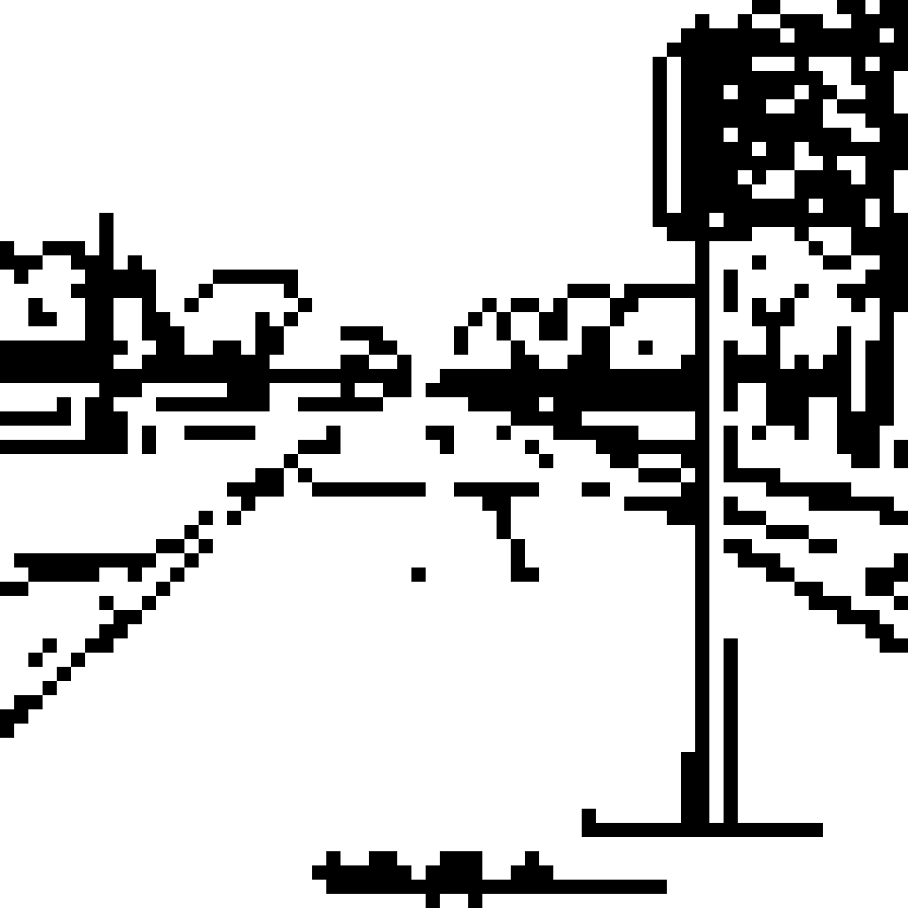
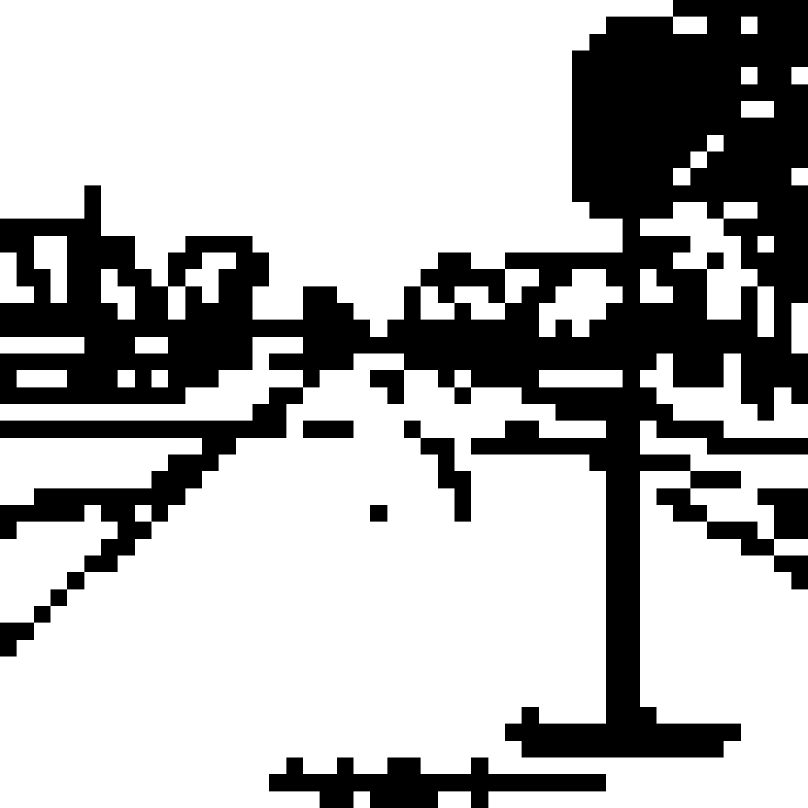
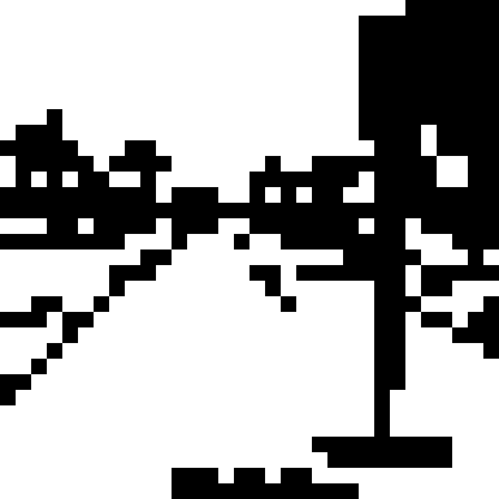
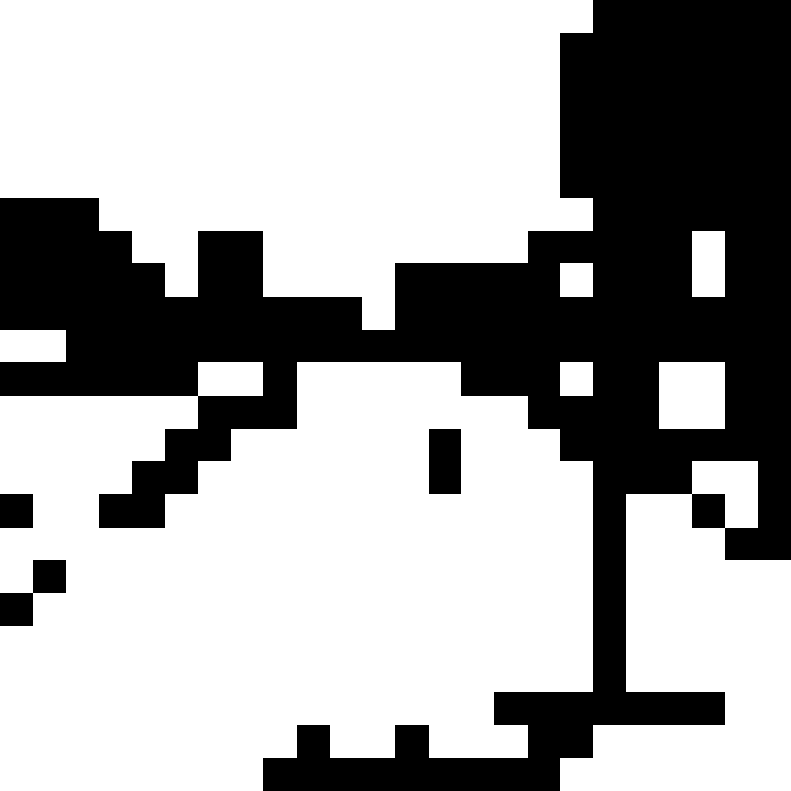
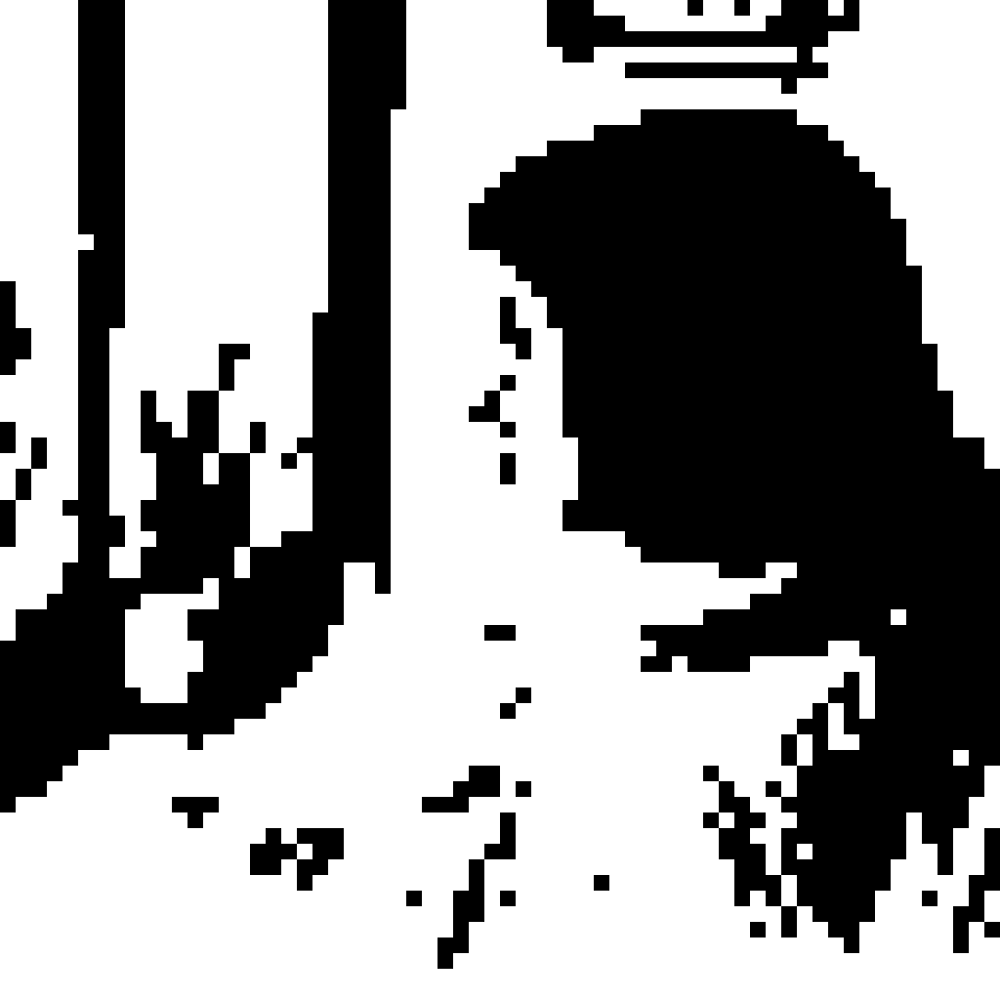
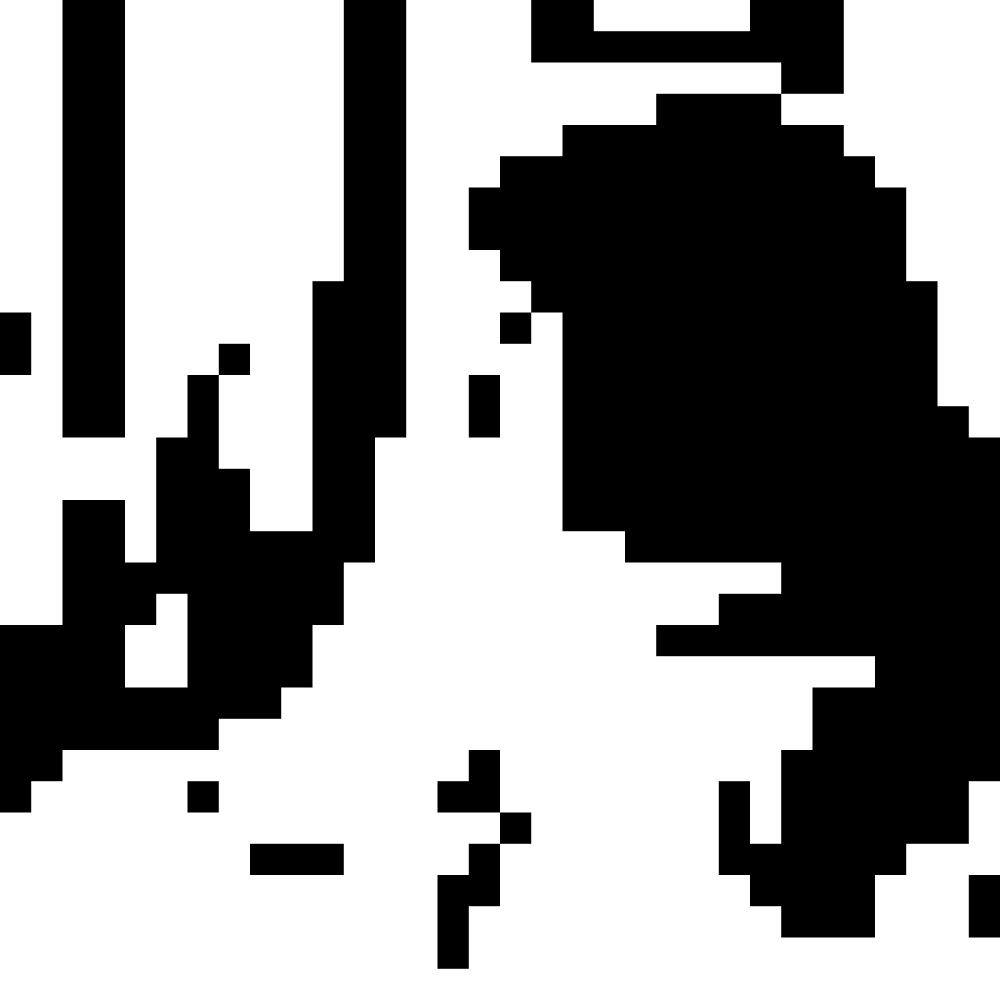
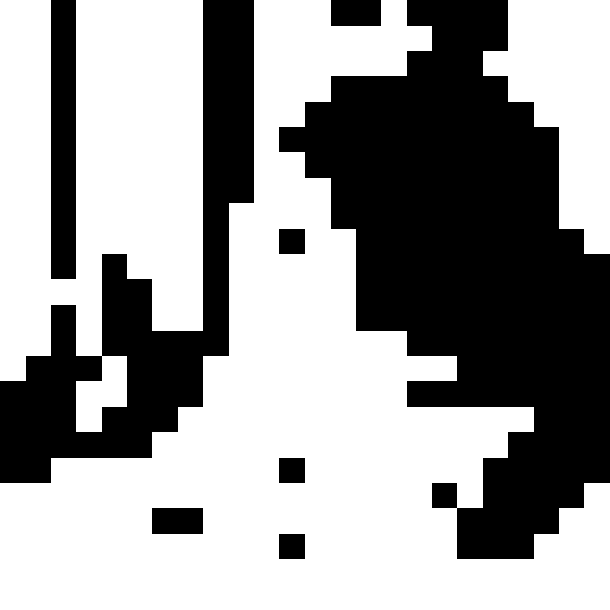

# local-ai-rnd

Research notes on what on-device image generation can do in 2026 — what
models run on iPhone and Android phones without per-platform engineering,
how good the output gets, and how the speed / quality / aesthetic dials
trade off.

The PC scaffold here is the testbed: a small diffusers + Gradio harness
that lets us try a checkpoint, look at the result, and decide whether it
is worth carrying to mobile. The committed `samples/` images and the
notes below are the actual research output.

## Hardware envelope of this PC

- AMD Radeon Pro 580X (4 GB), CPU torch only — no CUDA, no torch-directml
- Python 3.9, diffusers + transformers + Gradio
- Reference numbers below are for **CPU FP32 inference**. For comparison:
  - DirectML on the Radeon: ~5-10× faster than these numbers
  - iPhone 14+ Apple Neural Engine: ~3-10 s for the same workloads
  - Snapdragon 8 Gen 2 Hexagon NPU: ~5-10 s

That gap matters because everything below is targeting "what runs on a
phone in the background while charging" — slow on PC ≠ slow on device.

## Random-weeks: protagonist rotation per week

The product question is "given a week of small water-drinking moments
(when, where, what weather), make me a postcard that *is different
every week and surprises me*". An earlier version of the prompt builder
hard-coded "N water cups arranged in a row" as the first subject, which
made every week's output a row of cups regardless of the data — the
diary was the fingerprint, not the mood.

The current builder ([src/prompt_builder.py](src/prompt_builder.py))
scores four protagonist axes per week:

- **cups**: water_event_count is unusually high (≥25) or low (≤5)
- **weather**: 6+ day streak of rain or snow, or a non-sunny majority
- **place**: one category accounts for ≥40% of visits
- **time**: sips concentrated ≥40% in one bucket (morning/night carry
  more weight than afternoon/evening)

Argmax picks the week's protagonist deterministically (same data →
same image; different week → different axis → different image).
Three atmospheric phrases — one for the protagonist axis, two
supporting — are drawn from per-axis pools to compose a quiet scene
instead of a literal object count.

Four reference seeds, each engineered to fire a different axis:

| seed | week shape | protagonist | leading moment phrase |
|---|---|---|---|
| 11 | rainy 6 of 7 days | **weather** | "umbrellas crossing a quiet alley" |
| 22 | cafe visited daily | **place** | "a corner cafe with steam rising from a teapot" |
| 33 | every sip 06:00-10:00 | **time** | "morning steam from a fresh cup" |
| 44 | 36 sips in a week | **cups** | "many half-finished glasses on a wooden table" |

`scripts/dump_random_prompts.py` prints the full prompts and scores
without paying for SD inference — useful for tuning the rotation logic.

### Closing the gap to the GPT-4o '하찮은 프롬프트' look

The original viral GPT-4o output is 1-bit mouse-drawn MS Paint: hard
edges, no anti-aliasing, white paper, distorted-but-recognizable
shapes. SD-Turbo gets the *shapes* right but ships anti-aliased
lines and a full RGB palette. The fix is a post-process —
[src/kasun_filter.py](src/kasun_filter.py) — that forces:

1. Lanczos downsample to a chunky grid (32-64 px)
2. Convert to grayscale, autocontrast, auto-invert if dark-dominated,
   then bilevel-threshold (Otsu picks the cutoff per image)
3. Nearest-neighbor upscale to 1024×1024 — every block a hard pixel

Optional 1-3 px per-row horizontal jitter for the "extreme" preset
fakes mouse-tremor lines.

The same SD-Turbo doodle, four kasun intensities applied
([scripts/kasun_demo.py](scripts/kasun_demo.py)):

| source | light | medium | heavy | extreme + jitter |
|---|---|---|---|---|
|  |  |  |  |  |
|  |  |  |  |  |

`light` is the closest match to the GPT-4o aesthetic — recognizable
scene, hard pixels, white paper. Heavier presets dissolve into
abstract bitmap glyphs which is its own thing but loses the original
"earnestly drawing the photo" energy.

Full ladder at [samples/kasun_grid.md](samples/kasun_grid.md).

**Mobile note**: every operation in `kasun_filter` is plain pixel ops
(downsample, threshold, palette lookup, nearest upscale). Maps 1:1 to
iOS Core Image and Android Bitmap APIs. *No extra ML model* — the
filter stacks on top of the same SD-Turbo Core ML / ONNX pipeline
already documented for mobile. The only on-device dependency is
SD-Turbo itself, which is already pre-converted on `coreml-community`
and exportable via `optimum-cli`.

### Same data → different result every time

In production the user's weekly data is often similar (same workplace,
similar weather patterns, regular drinking times). If the postcard is
deterministic, every Sunday morning gives the same picture and the
surprise dies. The pipeline therefore runs *without* fixing any RNG by
default — phrase pool selection in `prompt_builder.build()` and SD
init noise both vary per call.

[scripts/same_data_variety.py](scripts/same_data_variety.py) holds
data fixed (seed 22 = place_cafe shape) and runs the pipeline four
times to demonstrate the spread. The protagonist axis stays the same
(it's a data property), but moments and image vary call-to-call:

| variant | raw txt2img | kasun (1-bit) | pixel (16-color) |
|---|---|---|---|
| v1 (cafe + steam + afternoon sun) |  |  |  |
| v2 (marble counter + espresso + morning) |  |  |  |
| v3 (counter + park bench + desk lamp) |  |  |  |
| v4 (counter + park bench + evening) |  |  |  |

So the design contract is: **data → same week's protagonist axis;
each generation → a fresh phrasing and a fresh SD seed**. The user
opens the app, looks at last week's postcard, and gets a recognizable
"a week of cafe visits" feeling rendered in a way they have never
seen before.

### True pixel art via post-process

The original prompt's "픽셀 하나하나 보이는 저화질" line is asking for
*actual* pixel-perfect output. SD outputs look pixel-ish but ship with
anti-aliased edges and a full RGB palette. The fix is post-process:
[src/pixelize.py](src/pixelize.py) downsamples to 64×64, median-cut
quantises to 16 colors, then upscales nearest-neighbor — every 8×8
block becomes a single solid pixel. Outputs are 1024×1024 so the
chunky pixels read clearly on HiDPI displays.

| seed | doodle (raw SD) | pixel-perfect |
|---|---|---|
| 11 (windy) |  |  |
| 22 (cloudy) |  |  |
| 33 (snowy) |  |  |
| 44 (windy) |  |  |

(Full table with collages and per-seed prompts in
[samples/random_weeks.md](samples/random_weeks.md).)

**Two findings.**

1. The prompt builder really does respond to the data — different
   RNG seeds yield different scenes (kettle + cabinet, city skyline,
   bookshelves with stars, bicycle + plants). After lifting the cup
   cap from 8 → 24, the per-week cup count itself also varies (these
   four seeds now resolve to 13, 13, 16, 24 cups instead of all 8).
2. SD-Turbo on this prompt produces mostly black ink on white. When
   pixelize quantises to 16 colors, the palette collapses to grayscale
   and the result reads as a *Game Boy / vintage calculator screen*
   instead of MS Paint. Arguably stronger "pixel-perfect" energy than
   the original prompt asked for — a happy accident worth keeping.

### img2img vs. txt2img: same prompts, two pipelines

`random_weeks_doodle.py` uses **img2img** — the deterministic
pictographic collage acts as a layout guide and SD-Turbo redraws it in
the doodle style. Every week's output therefore inherits the same
"white postcard with cups in rows + small icons scattered" structure;
data variation shows up in *what* gets drawn, not *where*.

[scripts/random_weeks_txt2img.py](scripts/random_weeks_txt2img.py) is
the pure **txt2img** counterpart — same prompts, no collage seed, a
different noise seed per week. The model is free to imagine the layout
itself.

| seed | img2img (collage seed) | txt2img (free noise) | txt2img + pixelize |
|---|---|---|---|
| 11 (24 cups, windy) |  |  |  |
| 22 (16 cups, cloudy) |  |  |  |
| 33 (13 cups, snowy) |  |  |  |
| 44 (13 cups, windy) |  |  |  |

**Reading.** The two pipelines answer different questions:

- **img2img** is the layout-stable path. Output stays close to the
  collage and the white-paper background of the original prompt is
  preserved. This is closer to the canonical 하찮은 프롬프트 use case
  (which was always img2img on a real photo) but visually similar
  across seeds.
- **txt2img** lets SD compose freely. Outputs are full-bleed,
  saturated, very different per seed — a Christmas-card pattern of red
  and white cups for one seed, a yellow city nightscape for another.
  Less faithful to the "white doodle on paper" intent but much wider
  variation.
- The txt2img path also stacks beautifully with pixelize: flat
  saturated colors survive the 16-color quantization, so the result
  reads as a 16-bit-game pattern instead of the grayscale Game Boy
  screen the img2img version collapses to. `random_w11_txt2img_pixel`
  is currently the strongest pixel-art result in the repo.

### Pixelize over colorful sources: 16-bit cutscene aesthetic

Pixelize on monochrome SD-Turbo collapses to grayscale. Pixelize on a
*colorful* SD output is a different beast — the 16-color median-cut
keeps the source palette and the result reads as a specific era of
dot illustration (Final Fantasy / Chrono Trigger 16-bit RPG cutscenes).

[scripts/pixelize_existing.py](scripts/pixelize_existing.py) applies
two palettes to seven existing samples — no SD inference, ~1 s total:

- `pixel16_*` — 64×64 grid, 16-color median-cut chosen per image
- `pixelgb_*` — 64×64 grid, fixed 4-color Game Boy DMG-01 palette

| source | 16-color (vibrant retro) | Game Boy (1989 DMG) |
|---|---|---|
|  |  |  |
|  |  |  |
|  |  |  |
|  |  |  |
|  |  |  |

(Full table at [samples/pixelize_grid.md](samples/pixelize_grid.md).)

**Two findings.**

1. The strongest result is `pixel16_drill_mom_korean_living_room`. The
   round-2 winner was already an earnest-amateur Korean-grandma frame;
   the pixelize pass stacks a *second* nostalgia register (1990s pixel
   art) on top of the first (1980s living-room frame), and the two
   reinforce each other instead of competing. This is now the strongest
   single candidate in the repo.
2. Pixelize works best on flat backgrounds with saturated palettes —
   exactly what 16-bit games used. `viral_hotel_art_70s` is the second
   strongest because its avocado-green wall + yellow frame + red shirt
   match what an SNES illustrator would have actually drawn.

The Game Boy 4-color palette is a separate dial: stronger nostalgia
hit, less subject fidelity. Best on high-contrast portrait subjects.

## Speed dial: SD-Turbo (1-4 steps)

SD-Turbo is the "fast" end. Single-step generation, ~1.4 GB model.

| input | output |
|---|---|
| Rule-rendered pictographic collage from `data/sample_week.json` (used as the img2img seed) |  |
| img2img redraw — 32.5 s on CPU, `strength=0.99`, 4 steps |  |
| txt2img — 24.3 s on CPU, 4 steps |  |

Three lessons (see commits `0922e01` and `ec7dc20`):

1. **Front-load style tags.** CLIP truncates at 77 tokens; whatever is at
   the front of the prompt dominates. Putting style at the tail silently
   loses the style.
2. **Keep text off the img2img seed.** SD interprets text in the seed as
   text and emits garbled fake text in the output — use pure pictograms.
3. **`strength * steps` is the denoising budget.** On 4-step SD-Turbo,
   `strength < 0.95` leaves the seed image too visible.

## Quality dial: SD 1.5 fine-tunes (30 steps Euler-a)

The opposite end. Same prompt + seed across both:

| model | runtime (CPU) | output |
|---|---|---|
| `Lykon/dreamshaper-8` (realistic / versatile) | 246 s |  |
| `dreamlike-art/dreamlike-anime-1.0` (anime) | 249 s |  |

So the PC ceiling is "magazine-grade SD 1.5 in ~4 min/image" on plain CPU
torch. The same workload finishes in 3-10 s on a current-gen phone NPU,
which is why on-device generation is finally viable in 2026.

## Aesthetic dial: prompt-only style on a single base model

`Lykon/dreamshaper-8` + style prefix in the prompt, same subject + seed
across all entries — the only varying axis is the aesthetic preset
([src/styles.py](src/styles.py)).

| preset | output | finding |
|---|---|---|
| `watercolor_diary` |  | **lands cleanly** — paper texture, pastel washes, journal composition all read as watercolor |
| `risograph_zine` |  | palette landed but halftone / grain / registration drift missing → just a blue-tinted photo. Needs a riso LoRA. |
| `crayon_picturebook` |  | warm composition but lacks crayon physicality → reads as digital illustration. Also needs a LoRA. |

**Generalization**: SD 1.5 fine-tunes are strong on subject and lighting,
weak on medium-specific *physicality*. Anything where the texture of the
medium is the point (riso, crayon, linocut) needs a dedicated LoRA. Looks
like watercolor or painterly illustration come essentially for free.

## Viral-aesthetic search

The "하찮은 프롬프트" trend went global in May 2025 because it stacked
five things at once: a meta-instruction (be deliberately inept),
recognizable-but-wrong output, earnest amateur energy, one-prompt
reusability, and a strong cultural rhyme (MS Paint).

[scripts/style_viral_search.py](scripts/style_viral_search.py) tries
five candidate aesthetics that share that DNA but explore different
cultural rhymes — to see whether SD 1.5 can deliver the same kind of
"recognizable + earnest + slightly wrong" charge through a single
short prompt. All five run on `dreamlike-art/dreamlike-diffusion-1.0`
(the most painterly fine-tune in the cross-platform table), same
subject + seed, 30 steps Euler-a (~4 min/image on CPU).

Same subject across all five: *"a young woman holding a coffee cup at
a cafe window, plants beside her"*.

| preset | output | reading |
|---|---|---|
| `renaissance_oil` |  | technically beautiful but the "elevate the mundane in oil paint" trope is already saturated. ★★★★ |
| `hotel_art_70s` |  | reads as *actual* 1970s mass-produced motel kitsch — wrong proportions, ugly palette, sad-but-charming. **★★★★★** |
| `embroidered_sampler` |  | cross-stitch face + scene, distinctive medium-as-message. Pixelation reads as "intentionally limited," warm grandma-craft DNA. **★★★★★** |
| `friends_mom_portrait` |  | closest cousin to 하찮은 프롬프트: same amateur-sincerity DNA in a *different cultural rhyme* (a 2003 colored-pencil sketch by a sincere suburban mom). **★★★★★** |
| `half_remembered_film` |  | beautiful but aspirational — looks like a magazine ad, not a meme. Missing "wrongness." ★★★ |

**Reading the result space.** Three of the five actually carry the DNA:
`hotel_art_70s` and `embroidered_sampler` for their distinctive media,
`friends_mom_portrait` for being the most novel formulation — same
earnest-amateur energy as the original trend but in a different
medium and cultural reference. `renaissance_oil` lands but is already
heavily memed; `half_remembered_film` is too clean — no wrongness, no
hook.

### Round 2: drill into the two strongest finds

[scripts/style_viral_drill.py](scripts/style_viral_drill.py) runs four
variants — two on each of `friends_mom_portrait` and `hotel_art_70s` —
with the same subject and seed for direct comparison.

| variant | output | reading |
|---|---|---|
| `mom_korean_living_room` |  | red wooden frame, dark navy starry background, green cardigan, plant — *reads as the kind of art on every Korean grandmother's living-room wall*. The frame is included **inside the image**, adding one more layer of meta to the "earnest hung-up amateur art" idea. **★★★★★ — round-2 winner, beats round-1.** |
| `retired_engineer_watercolor` |  | competent loose watercolor, but "retired engineer" identity does not read visually — looks like generic amateur watercolor. ★★★★ |
| `korean_wedding_hall_90s` |  | the model is *too familiar* with this motif and renders it competently — loses the kitsch we wanted. ★★★ |
| `doctors_office_85` |  | captures the soothing institutional palette but the hook is mild. ★★★★ |

**One real lesson.** Cultural specificity helps when the model has
*just enough* prior knowledge to recognize the rhyme but not enough to
render it perfectly. `mom_korean_living_room` hits the sweet spot —
recognizable but slightly off, with the framed-on-wall presentation
landing as a separate visual punchline. `korean_wedding_hall_90s`
overshoots into "competent" because the model has seen too many of
those.

### Current ranking

1. `mom_korean_living_room` — earnest amateur + Korean frame meta + globally legible
2. `friends_mom_portrait` — same DNA in a different cultural rhyme
3. `hotel_art_70s` — distinctive ugly-kitsch
4. `embroidered_sampler` — distinctive medium

The single most interesting candidate is now `mom_korean_living_room`:
the rhyme is specific enough to be funny but generic enough to apply
to any subject ("draw it like the painting on a Korean grandmother's
living-room wall, in its frame"), which is the four properties that
made the original 하찮은 프롬프트 portable across languages.

## Cross-platform availability: which models ship without our own conversion

The interesting practical question for on-device deployment is: which
checkpoints are already pre-converted for Apple Core ML (so iOS is a
zero-conversion drop-in) AND can be ONNX-exported for Android via a
single `optimum-cli` command?

| base checkpoint | iOS pre-converted (Hugging Face) | Android (ONNX) |
|---|---|---|
| `stable-diffusion-v1-5/stable-diffusion-v1-5` | `apple/coreml-stable-diffusion-v1-5` (official Apple) | `optimum-cli export onnx` |
| `stabilityai/sd-turbo` | `apple/coreml-*` (official Apple) | `optimum-cli export onnx` |
| `Lykon/dreamshaper-8` | `coreml-community/coreml-DreamShaper-v8_cn` | `optimum-cli export onnx` |
| `dreamlike-art/dreamlike-diffusion-1.0` | `coreml-community/coreml-dreamlike-diffusion` | `optimum-cli export onnx` |
| `dreamlike-art/dreamlike-photoreal-2.0` | covered by `coreml-community` | `optimum-cli export onnx` |
| `dreamlike-art/dreamlike-anime-1.0` | covered by `coreml-community` | `optimum-cli export onnx` |
| `prompthero/openjourney` | covered by `coreml-community` | `optimum-cli export onnx` |
| `SG161222/Realistic_Vision_V5.1_noVAE` | `coreml-community/coreml-realisticVision-v51VAE_cn` | `optimum-cli export onnx` |

Reference samples generated on this PC for the four models we hadn't
already exercised (same prompt + seed across all four):

| model | output |
|---|---|
| `stable-diffusion-v1-5` (baseline) |  |
| `dreamlike-diffusion-1.0` |  |
| `openjourney` |  |
| `dreamlike-photoreal-2.0` |  |

(See [scripts/cross_platform_demo.py](scripts/cross_platform_demo.py).)

## Mobile architecture notes

The full notes on background-task scheduling, Core ML / MediaPipe
deployment, app size, and what is *verified vs. assumed* live in
[docs/mobile-architecture.md](docs/mobile-architecture.md). Highlights:

- **iOS**: pre-converted `.mlpackage` via Apple's `ml-stable-diffusion`
  Swift library. No conversion code needed for any of the models above.
- **Android**: `optimum-cli export onnx` once → ONNX Runtime Mobile with
  NNAPI / QNN delegates. Same checkpoint, same prompt, same result.
- **Background scheduling** (`BGProcessingTask` on iOS, `WorkManager` +
  Foreground Service on Android) makes the "slow inference is fine" path
  viable: phone runs the model overnight while charging.
- **LoRA hot-swap** is not supported on either platform — each LoRA
  needs to be merged into a base checkpoint and shipped as its own
  artifact. Watercolor doesn't need a LoRA, so the no-LoRA path is the
  cheapest aesthetic to ship.

## Repository layout

```
local-ai-rnd/
  data/sample_week.json             synthetic 7-day record (no real user data)
  src/diary.py                      load + summarize the synthetic week
  src/prompt_builder.py             WeekSummary -> SD prompt
  src/base_collage.py               WeekSummary -> PIL collage (img2img seed)
  src/generator.py                  SD-Turbo txt2img + img2img wrapper
  src/styles.py                     aesthetic presets (watercolor, riso, ...)
  src/app.py                        Gradio UI
  scripts/refresh_samples.py        regenerate the SD-Turbo reference images
  scripts/quality_demo.py           regenerate the 30-step quality references
  scripts/style_explore.py          regenerate the aesthetic-preset references
  scripts/cross_platform_demo.py    regenerate the cross-platform references
  docs/mobile-architecture.md       on-device deployment plan
  samples/                          committed reference outputs
```

## Run it

Windows (PowerShell), Python 3.9+:

```powershell
# 1. (one-time) create venv + install deps
py -m venv .venv
.\.venv\Scripts\python.exe -m pip install -r requirements.txt --extra-index-url https://download.pytorch.org/whl/cpu

# 2. launch the Gradio UI locally
.\.venv\Scripts\python.exe -m src.app

# 2b. or expose a public *.gradio.live tunnel (link expires in ~72h, anyone
#     with the URL can use it — don't leave it running unattended)
.\.venv\Scripts\python.exe -m src.app --share
```

Then open http://127.0.0.1:7860.

To regenerate any of the reference image groups in `samples/`:

```powershell
.\.venv\Scripts\python.exe scripts\refresh_samples.py        # SD-Turbo references
.\.venv\Scripts\python.exe scripts\quality_demo.py           # 30-step references
.\.venv\Scripts\python.exe scripts\style_explore.py          # aesthetic presets
.\.venv\Scripts\python.exe scripts\cross_platform_demo.py    # cross-platform
```

### First run

The first invocation downloads the relevant model weights from Hugging
Face into the local cache (~1.4 GB for SD-Turbo, ~4 GB per SD 1.5
fine-tune). Subsequent runs are cached.

### Optional GPU acceleration on AMD/Intel (Windows)

```powershell
.\.venv\Scripts\python.exe -m pip install torch-directml
$env:LAR_DEVICE = "directml"
.\.venv\Scripts\python.exe -m src.app
```

DirectML on the Radeon should be ~5-10× faster than the CPU numbers
quoted above.

### Environment knobs

| Variable        | Default                      | Notes                                 |
|-----------------|------------------------------|---------------------------------------|
| `LAR_MODEL_ID`  | `stabilityai/sd-turbo`       | Override for the Gradio app's default |
| `LAR_STEPS`     | `2`                          | SD-Turbo is happy at 1-4              |
| `LAR_GUIDANCE`  | `0.0`                        | SD-Turbo is trained with guidance off |
| `LAR_STRENGTH`  | `0.85`                       | img2img: lower = closer to base       |
| `LAR_DEVICE`    | auto (cuda > directml > cpu) | Force `cpu` or `directml`             |
