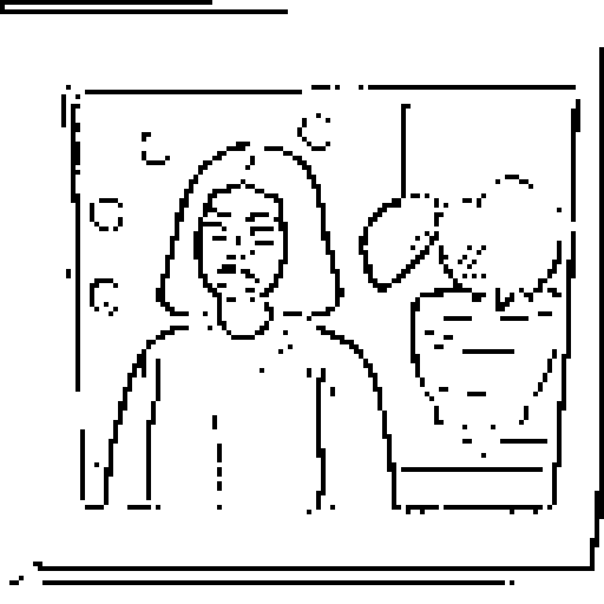
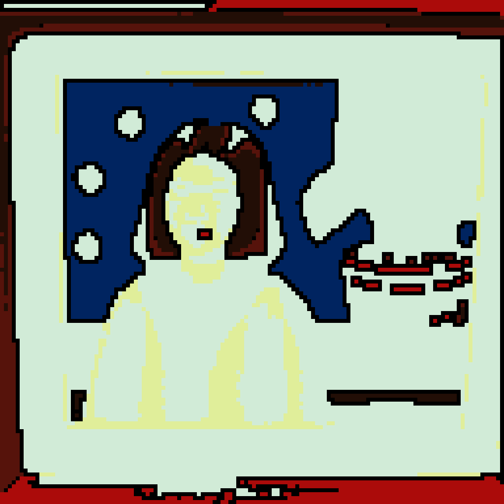

# kasun v2: 단색선 vs 컬러 낙서풍

Two distinct sub-styles inside the 'doodle' look. Both are pure
pixel-op post-process, no extra ML model.

| source | 단색선 (line-only) | 컬러 낙서풍 (flat fill + outline) |
| --- | --- | --- |
|  |  |  |
|  |  |  |
|  |  |  |
|  |  |  |
|  |  |  |
