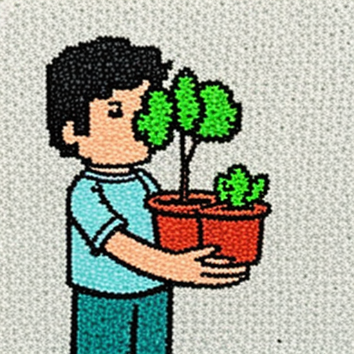
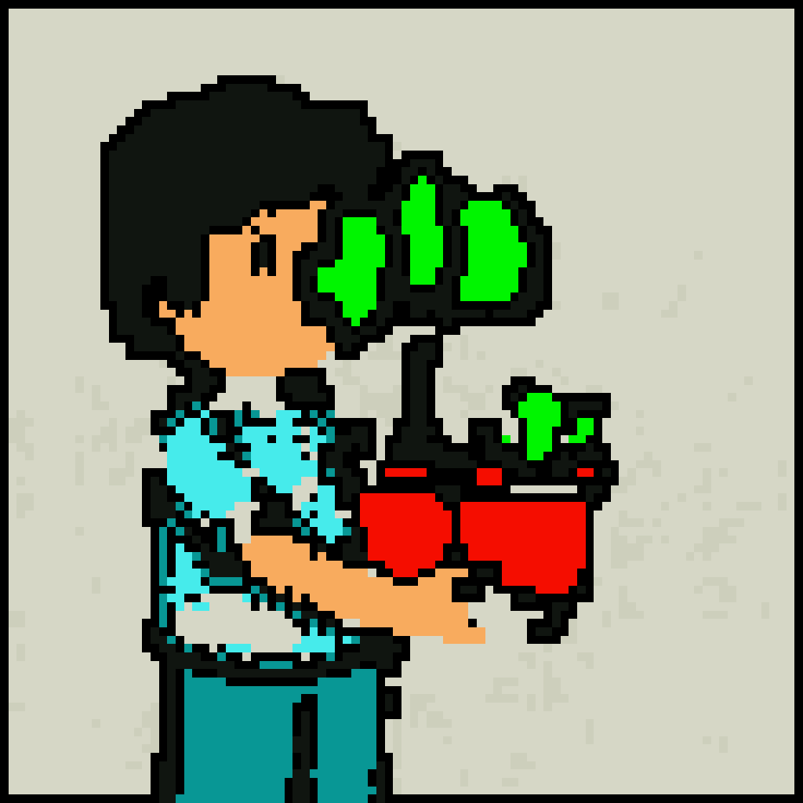
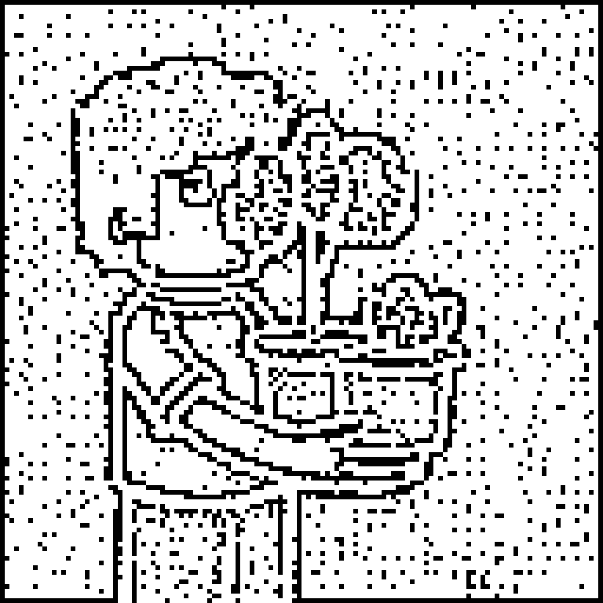

# kasun match attempt vs user ChatGPT reference

Pipeline: photo -> SD-Turbo img2img (doodle prompt) -> kasun.

| stage | image |
| --- | --- |
| input photo |  |
| SD-Turbo img2img |  |
| kasun_color |  |
| kasun_line |  |
| **ChatGPT reference (target)** |  |
