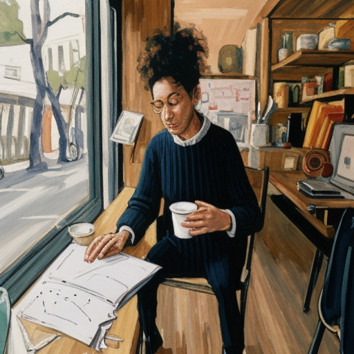
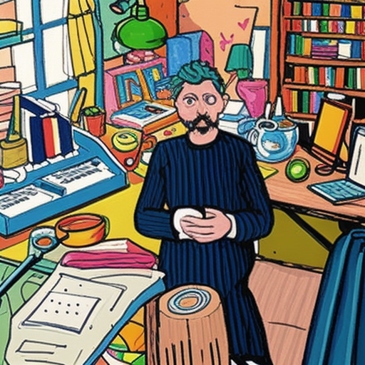

# v5 — minimal post-process, lean on SD-Turbo prompt

v4 (img2img + rembg + kasun_color) went too far: looked like an
8-bit sprite, not the trend's hand-drawn doodle. v5 strips the
post-process down to a tiny desaturation pass and leans on the
SD-Turbo prompt to hit the wobbly-mouse-drawn aesthetic.

| stage | image |
| --- | --- |
| input |  |
| v5 SD strength=55% |  |
| v5 final (s55) — soft finish |  |
| v5 SD strength=70% |  |
| v5 final (s70) — soft finish |  |
| v5 SD strength=85% |  |
| v5 final (s85) — soft finish |  |
| target — ChatGPT 하찮은 |  |
