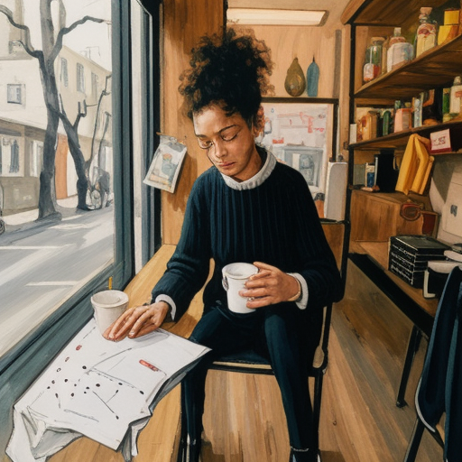
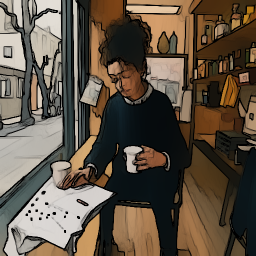
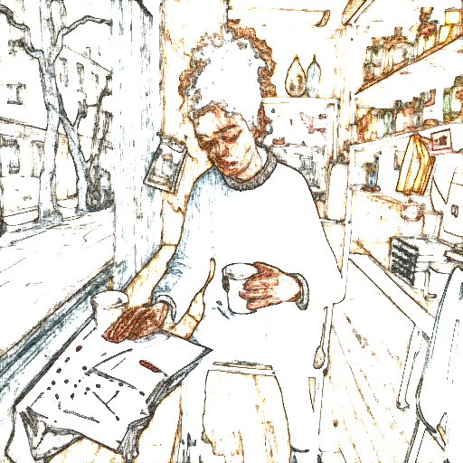

# v6 — cv2 stylization / pencilSketch on SD-Turbo output

v5 showed SD-Turbo can't make the shaky-mouse-drawn look on its
own. v6 keeps SD-Turbo's natural cartoon output and applies
OpenCV's purpose-built hand-drawn filters.

| variant | image |
| --- | --- |
| input photo |  |
| SD-Turbo (cartoon, no filter) |  |
| stylize_60_045 |  |
| stylize_100_06 |  |
| stylize_150_07 |  |
| pencil_60_07_005 |  |
| pencil_100_01_010 |  |
| pencil_30_05_005 |  |
| **target — ChatGPT 하찮은** |  |
