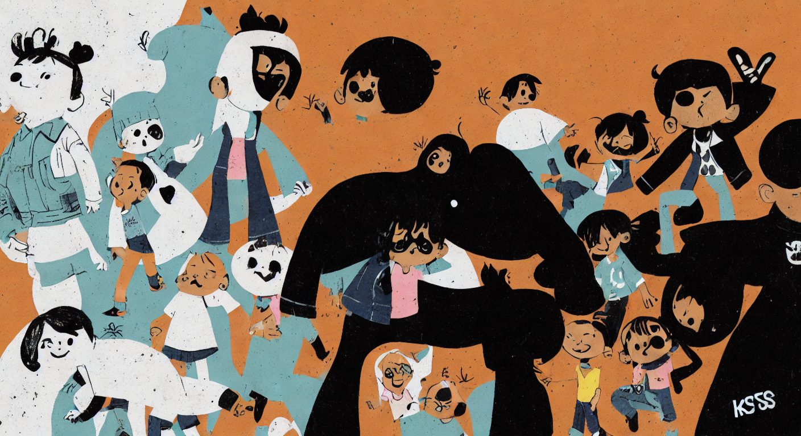
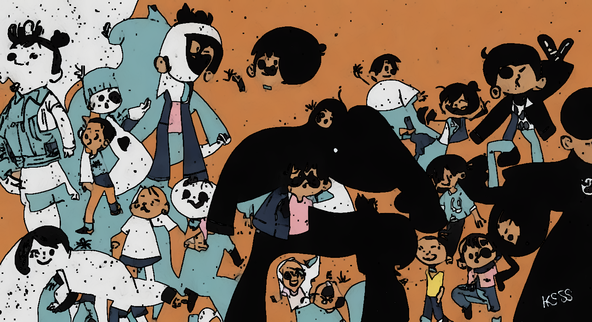
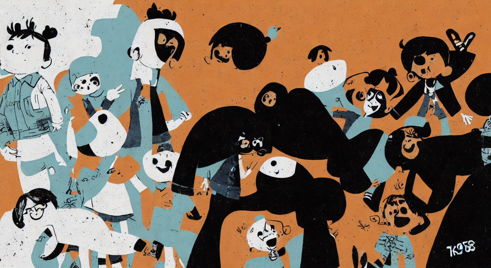
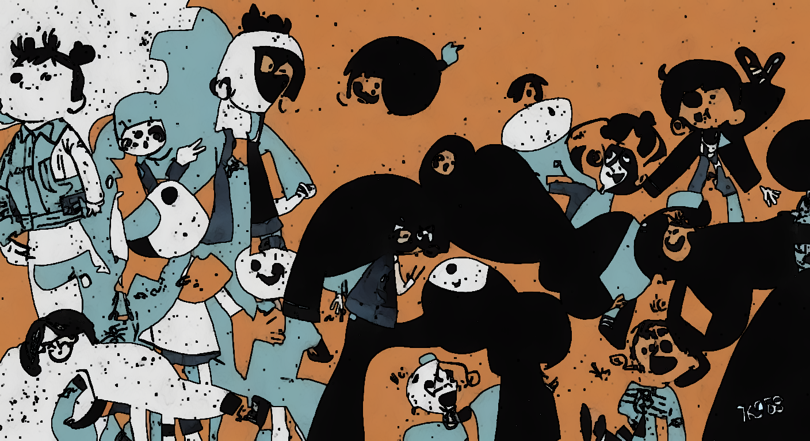

# v9 — SD-Turbo + COOLKIDS LoRA + cv2 stylize + jitter

Adds the COOLKIDS V2 LoRA (Clumsy_Trainer, SD 1.5 compatible,
144 MB) so SD-Turbo natively produces children-book illustration
without needing as heavy post-processing.

| variant | image |
| --- | --- |
| input |  |
| LoRA scale=0.6 (raw SD) |  |
| LoRA scale=0.6 + cv2 (no jitter) |  |
| LoRA scale=0.9 (raw SD) |  |
| LoRA scale=0.9 + cv2 (no jitter) |  |
| target — ChatGPT 하찮은 |  |
| user-favourite — v5 s=0.85 |  |
