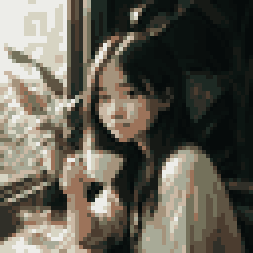
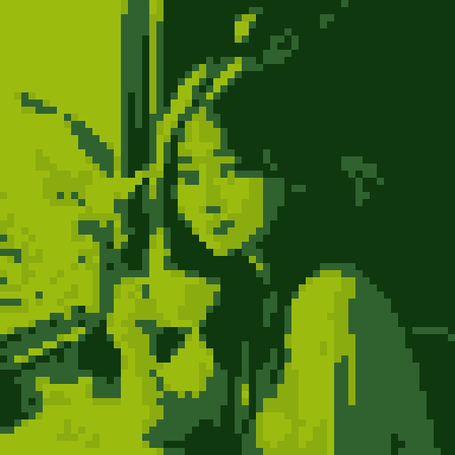
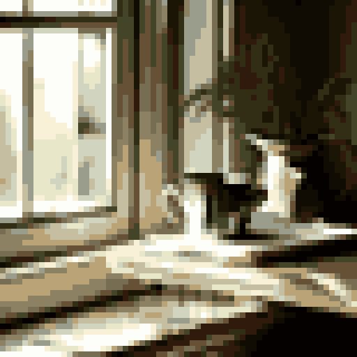
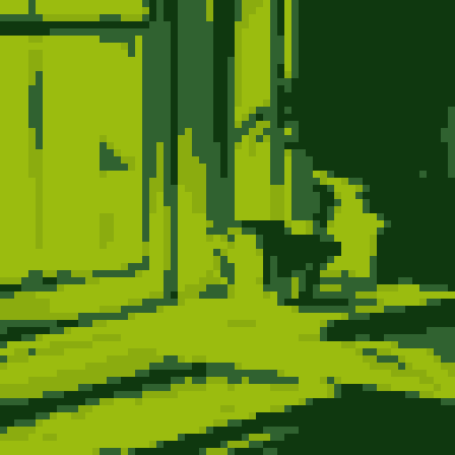

# Pixelize gallery

Existing colorful samples remapped through `src/pixelize.py`. No SD
inference — pure PIL post-process.

- `pixel16_*.png`: 64×64 grid, 16-color median-cut palette picked per
  image. Preserves source colors with a retro paint-program feel.
- `pixelgb_*.png`: 64×64 grid, fixed 4-color Game Boy DMG-01 palette.
  Forces a 1989 game-screen aesthetic regardless of source colors.

| source | 16-color | Game Boy |
| --- | --- | --- |
|  |  |  |
|  |  |  |
|  |  |  |
|  |  |  |
|  |  |  |
|  |  |  |
|  |  |  |
