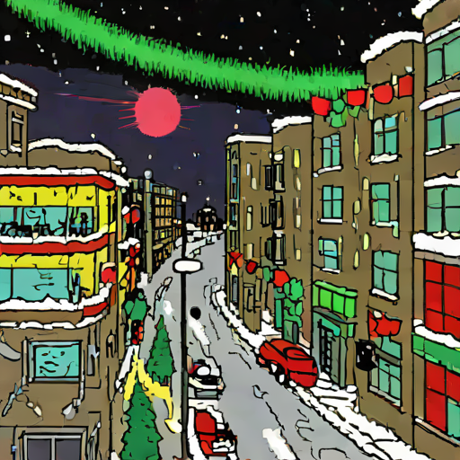
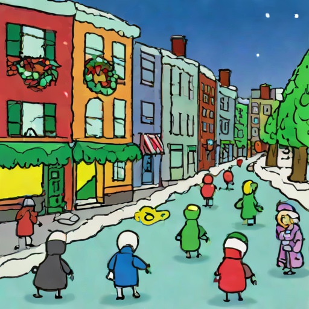
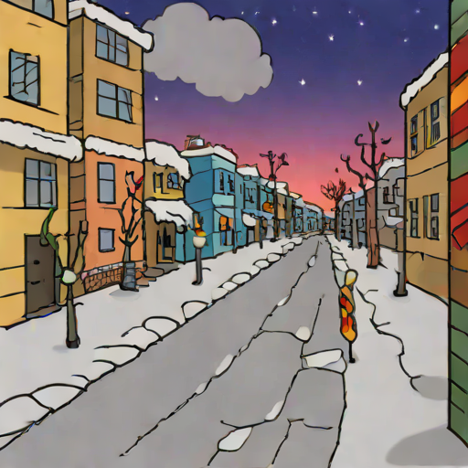

# Two-LoRA randomness check — 4 calls each

Same `EVENT` dict, both style LoRAs (`worstimever`,
`mspaint_portraits`), 4 calls per LoRA. Each call draws
fresh phrases from the pools in `src/event_prompt.py`. The
diffusion seed also varies per cell so prompt + denoise
randomness combine.

| call # | worstimever | mspaint_portraits |
| --- | --- | --- |
| 0 |  |  |
| 1 |  |  |
| 2 |  |  |
| 3 |  |  |
