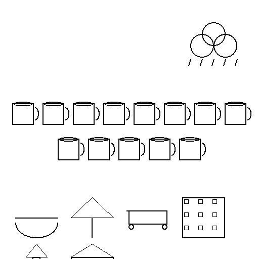
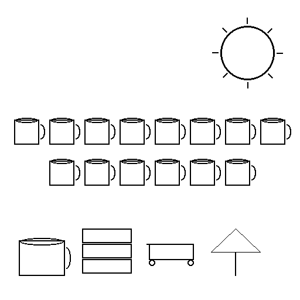
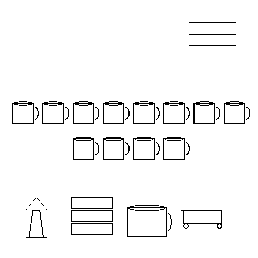
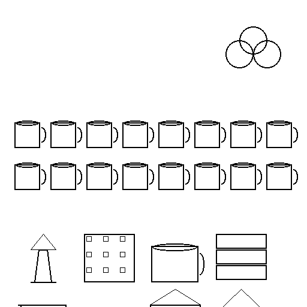

# Random weekly doodles

Four randomized weekly diaries fed through the same pipeline:

1. `make_random_week(seed)` synthesises a week of water/weather/places.
2. `prompt_builder.build()` turns it into an SD prompt + a deterministic
   pictographic collage (the img2img seed).
3. `generator.generate_img2img()` runs SD-Turbo at 4 steps, strength 0.99.
4. `pixelize()` enforces a true pixel-art look (64×64 grid, 16-color
   palette, nearest-neighbor upscale).

| seed | summary | subjects in prompt | collage | SD-Turbo doodle | pixel-perfect |
| --- | --- | --- | --- | --- | --- |
| 11 | Week 2026-04-27 ~ 2026-05-03 \| Total water: 3200 ml across 13 sips \| Avg/day: 457.1 ml \| Dominant weather: rainy (avg 10.0 C) \| Place categories: {'restaurant': 3, 'park': 3, 'market': 2, 'work': 1, 'landmark': 1, 'home': 1} \| Top places: Restaurant, Park, Market, Workplace, Tower | wet pavement reflecting streetlight; afternoon light filtering through leaves; afternoon light across a wooden floor |  |  |  |
| 22 | Week 2026-04-27 ~ 2026-05-03 \| Total water: 3700 ml across 14 sips \| Avg/day: 528.6 ml \| Dominant weather: sunny (avg 11.1 C) \| Place categories: {'cafe': 6, 'bookstore': 2, 'market': 1, 'park': 1} \| Top places: Cafe, Bookstore, Market, Park | a corner cafe with steam rising from a teapot; a sunny park bench in late afternoon; warm evening light through a window |  |  |  |
| 33 | Week 2026-04-27 ~ 2026-05-03 \| Total water: 2700 ml across 12 sips \| Avg/day: 385.7 ml \| Dominant weather: windy (avg 19.4 C) \| Place categories: {'landmark': 1, 'bookstore': 2, 'cafe': 1, 'market': 2} \| Top places: Bookstore, Market, Tower, Cafe | morning steam from a fresh cup; leaves swirling in afternoon air; produce in soft warm light |  |  |  |
| 44 | Week 2026-04-27 ~ 2026-05-03 \| Total water: 8600 ml across 36 sips \| Avg/day: 1228.6 ml \| Dominant weather: cloudy (avg 12.6 C) \| Place categories: {'landmark': 2, 'work': 2, 'cafe': 2, 'bookstore': 2, 'market': 1, 'restaurant': 2, 'home': 1, 'park': 1} \| Top places: Tower, Workplace, Cafe, Bookstore, Restaurant | many half-finished glasses on a wooden table; a quiet cloudy afternoon street; a quiet noodle shop at night; a long shadow on a quiet street |  |  |  |
